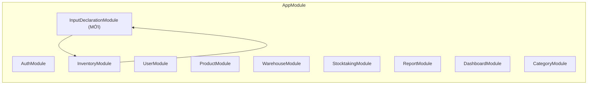
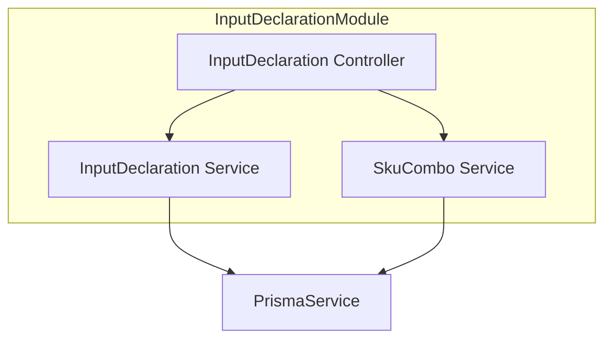
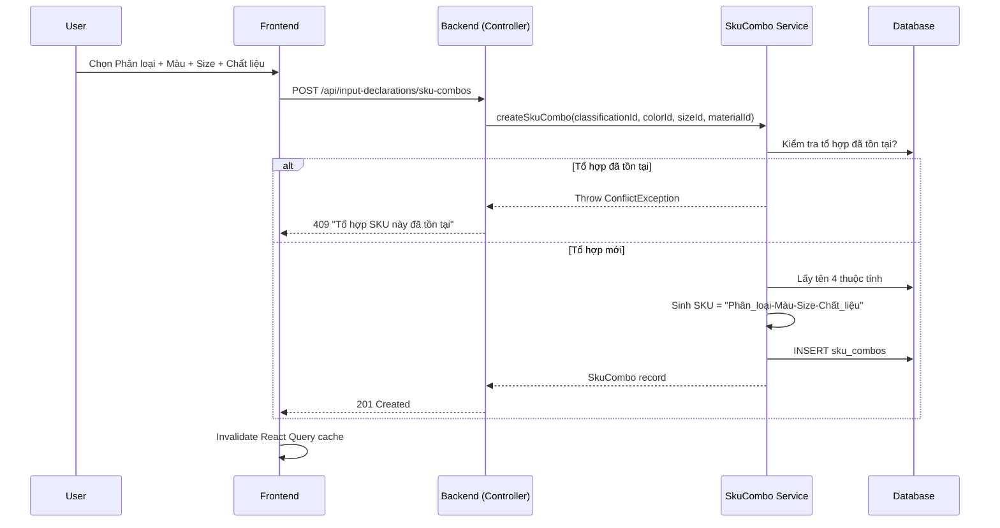
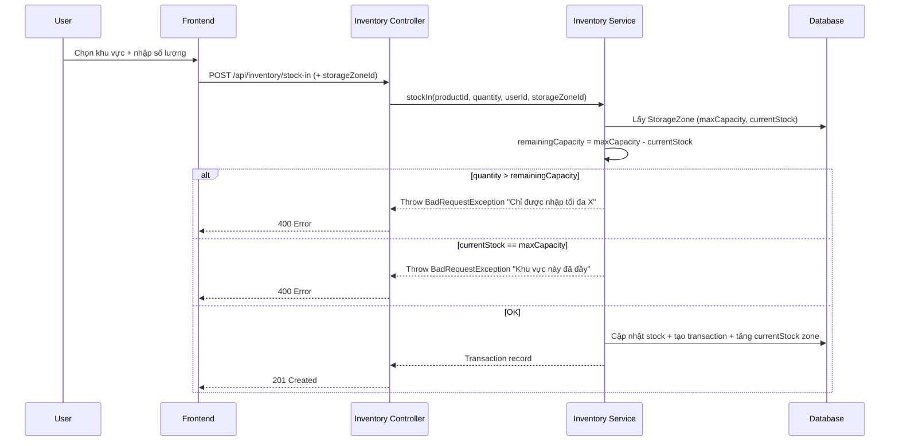
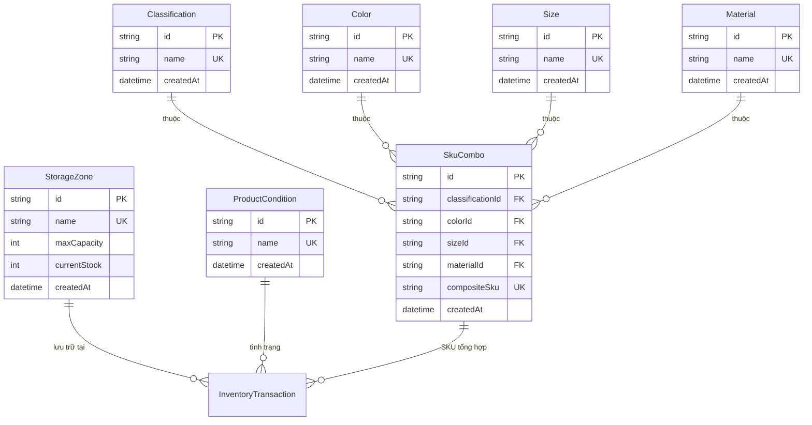

# Tài liệu Thiết kế - Module Khai báo Input (Input Declaration Module)

## Tổng quan (Overview)

Module Khai báo Input mở rộng Hệ thống Quản lý Kho hiện tại, cung cấp trang quản lý khai báo các trường thông tin đầu vào cho quy trình nhập/xuất kho. Module bao gồm ba khu vực khai báo chính:

1. **Thuộc tính sản phẩm**: Quản lý Phân loại, Màu, Size, Chất liệu — và tự động sinh SKU tổng hợp từ tổ hợp bốn thuộc tính.
2. **Tình trạng hàng hoá**: Quản lý danh sách tình trạng/chất lượng hàng hoá (Đạt tiêu chuẩn, Lỗi/Hỏng, Hàng khách kí gửi, ...).
3. **Khu vực hàng hoá**: Quản lý danh sách khu vực/thùng chứa hàng với kiểm soát sức chứa tối đa.

Tất cả giá trị khai báo sẽ trở thành tùy chọn dropdown trong form nhập/xuất kho hiện có.

**Công nghệ:** Giống hệ thống hiện tại:
- **Backend:** NestJS + TypeScript + Prisma ORM
- **Frontend:** React (Vite) + TypeScript + Tailwind CSS + Shadcn UI + React Query
- **Database:** PostgreSQL
- **Auth:** JWT + RBAC (đã có sẵn)
- **PBT Library:** fast-check (đã cài đặt cả backend và frontend)

**Quyết định thiết kế chính:**
- Tạo NestJS module mới `InputDeclarationModule` chứa tất cả logic khai báo, đăng ký vào `AppModule` hiện có
- Sử dụng chung `PrismaModule` và guards (JwtAuthGuard, RolesGuard) đã có
- Bốn bảng thuộc tính (Classification, Color, Size, Material) có cấu trúc giống nhau → dùng chung pattern service/controller
- SKU tổng hợp là bảng riêng với unique constraint trên tổ hợp 4 FK
- Khu vực hàng hoá (StorageZone) có trường `maxCapacity` và `currentStock` để kiểm soát sức chứa
- Tích hợp vào form nhập/xuất kho bằng cách thêm dropdown fields, mở rộng DTO hiện có
- So sánh trùng lặp case-insensitive sử dụng `LOWER()` trong Prisma query

## Kiến trúc (Architecture)

### Tích hợp vào kiến trúc hiện tại



### Cấu trúc InputDeclarationModule



### Luồng tạo SKU tổng hợp



### Luồng kiểm soát sức chứa khi nhập kho



## Thành phần và Giao diện (Components and Interfaces)

### Backend Components

#### 1. InputDeclaration Module

```typescript
// input-declaration.module.ts
@Module({
  controllers: [InputDeclarationController],
  providers: [InputDeclarationService, SkuComboService],
  exports: [InputDeclarationService, SkuComboService],
})
export class InputDeclarationModule {}
```

#### 2. InputDeclaration Controller

```typescript
// input-declaration.controller.ts
@Controller('input-declarations')
@UseGuards(JwtAuthGuard)
class InputDeclarationController {
  // === Phân loại (Classification) ===
  @Get('classifications')
  getClassifications(): Promise<Classification[]>

  @Post('classifications')
  createClassification(dto: CreateAttributeDto): Promise<Classification>

  // === Màu sắc (Color) ===
  @Get('colors')
  getColors(): Promise<Color[]>

  @Post('colors')
  createColor(dto: CreateAttributeDto): Promise<Color>

  // === Size ===
  @Get('sizes')
  getSizes(): Promise<Size[]>

  @Post('sizes')
  createSize(dto: CreateAttributeDto): Promise<Size>

  // === Chất liệu (Material) ===
  @Get('materials')
  getMaterials(): Promise<Material[]>

  @Post('materials')
  createMaterial(dto: CreateAttributeDto): Promise<Material>

  // === Tình trạng hàng hoá (ProductCondition) ===
  @Get('product-conditions')
  getProductConditions(): Promise<ProductCondition[]>

  @Post('product-conditions')
  createProductCondition(dto: CreateAttributeDto): Promise<ProductCondition>

  // === Khu vực hàng hoá (StorageZone) ===
  @Get('storage-zones')
  getStorageZones(): Promise<StorageZone[]>

  @Post('storage-zones')
  createStorageZone(dto: CreateStorageZoneDto): Promise<StorageZone>

  // === SKU tổng hợp (SkuCombo) ===
  @Get('sku-combos')
  getSkuCombos(query: SkuComboQueryDto): Promise<PaginatedResponse<SkuCombo>>

  @Post('sku-combos')
  createSkuCombo(dto: CreateSkuComboDto): Promise<SkuCombo>
}
```

#### 3. InputDeclaration Service

```typescript
// input-declaration.service.ts
class InputDeclarationService {
  // Generic CRUD cho các bảng thuộc tính đơn giản
  getAll(type: AttributeType): Promise<AttributeRecord[]>
  create(type: AttributeType, name: string): Promise<AttributeRecord>

  // Khu vực hàng hoá
  getAllStorageZones(): Promise<StorageZone[]>
  createStorageZone(name: string, maxCapacity: number): Promise<StorageZone>

  // Tình trạng hàng hoá
  getAllProductConditions(): Promise<ProductCondition[]>
  createProductCondition(name: string): Promise<ProductCondition>
}

type AttributeType = 'classification' | 'color' | 'size' | 'material';
```

#### 4. SkuCombo Service

```typescript
// sku-combo.service.ts
class SkuComboService {
  getAll(query: SkuComboQueryDto): Promise<PaginatedResponse<SkuCombo>>
  create(dto: CreateSkuComboDto): Promise<SkuCombo>
  generateCompositeSku(
    classificationName: string,
    colorName: string,
    sizeName: string,
    materialName: string,
  ): string  // Pure function: "Phân_loại-Màu-Size-Chất_liệu"
}
```

#### 5. DTOs

```typescript
// dto/create-attribute.dto.ts
class CreateAttributeDto {
  @IsString()
  @IsNotEmpty({ message: 'Tên không được để trống' })
  name: string;
}

// dto/create-storage-zone.dto.ts
class CreateStorageZoneDto {
  @IsString()
  @IsNotEmpty({ message: 'Tên khu vực không được để trống' })
  name: string;

  @IsInt()
  @Min(1, { message: 'Sức chứa tối đa phải lớn hơn 0' })
  maxCapacity: number;
}

// dto/create-sku-combo.dto.ts
class CreateSkuComboDto {
  @IsString() @IsNotEmpty()
  classificationId: string;

  @IsString() @IsNotEmpty()
  colorId: string;

  @IsString() @IsNotEmpty()
  sizeId: string;

  @IsString() @IsNotEmpty()
  materialId: string;
}

// dto/sku-combo-query.dto.ts
class SkuComboQueryDto {
  @IsOptional() @IsString()
  search?: string;

  @IsOptional() @IsNumberString()
  page?: string;

  @IsOptional() @IsNumberString()
  limit?: string;
}
```

#### 6. Mở rộng Inventory DTOs (stock-in, stock-out)

```typescript
// Mở rộng StockInDto hiện có
class StockInDto {
  @IsString() @IsNotEmpty()
  productId: string;

  @IsNumber() @Min(1)
  quantity: number;

  @IsOptional() @IsString()
  skuComboId?: string;       // MỚI: SKU tổng hợp

  @IsOptional() @IsString()
  productConditionId?: string; // MỚI: Tình trạng hàng hoá

  @IsOptional() @IsString()
  storageZoneId?: string;     // MỚI: Khu vực hàng hoá
}

// Tương tự cho StockOutDto
class StockOutDto {
  @IsString() @IsNotEmpty()
  productId: string;

  @IsNumber() @Min(1)
  quantity: number;

  @IsOptional() @IsString()
  skuComboId?: string;

  @IsOptional() @IsString()
  productConditionId?: string;

  @IsOptional() @IsString()
  storageZoneId?: string;
}
```

### Frontend Components

#### Cấu trúc thư mục mới

```
src/
├── pages/
│   └── InputDeclarationPage.tsx          # Trang khai báo input (MỚI)
├── components/
│   └── input-declaration/                # Thư mục components mới
│       ├── AttributeSection.tsx          # Component chung cho 4 thuộc tính
│       ├── ProductConditionSection.tsx   # Khu vực tình trạng hàng hoá
│       ├── StorageZoneSection.tsx        # Khu vực khu vực hàng hoá
│       ├── SkuComboTable.tsx             # Bảng tổng hợp SKU
│       └── CreateSkuComboForm.tsx        # Form tạo tổ hợp SKU
├── hooks/
│   └── useInputDeclarations.ts           # React Query hooks (MỚI)
```

#### React Query Hooks

```typescript
// hooks/useInputDeclarations.ts

// Hooks cho từng loại thuộc tính
function useClassifications(): UseQueryResult<Classification[]>
function useColors(): UseQueryResult<Color[]>
function useSizes(): UseQueryResult<Size[]>
function useMaterials(): UseQueryResult<Material[]>
function useProductConditions(): UseQueryResult<ProductCondition[]>
function useStorageZones(): UseQueryResult<StorageZone[]>

// Hooks cho SKU tổng hợp
function useSkuCombos(query: SkuComboQuery): UseQueryResult<PaginatedResponse<SkuCombo>>

// Mutation hooks
function useCreateClassification(): UseMutationResult
function useCreateColor(): UseMutationResult
function useCreateSize(): UseMutationResult
function useCreateMaterial(): UseMutationResult
function useCreateProductCondition(): UseMutationResult
function useCreateStorageZone(): UseMutationResult
function useCreateSkuCombo(): UseMutationResult
```

#### Tích hợp vào hệ thống hiện có

1. **App.tsx**: Thêm route `/input-declarations` → `InputDeclarationPage`
2. **AppLayout.tsx**: Thêm nav item "Khai báo Input" vào `navItems` array (không giới hạn role)
3. **StockInForm.tsx**: Thêm 3 dropdown mới (SKU tổng hợp, Tình trạng, Khu vực) + hiển thị thông tin sức chứa
4. **StockOutForm.tsx**: Thêm 3 dropdown mới tương tự
5. **types/index.ts**: Thêm các interface mới

## Mô hình Dữ liệu (Data Models)

### Prisma Schema mới (bổ sung vào schema.prisma hiện có)

```prisma
// === Thuộc tính sản phẩm ===

model Classification {
  id        String   @id @default(uuid())
  name      String   @unique  // Case-insensitive unique qua application logic
  createdAt DateTime @default(now())

  skuCombos SkuCombo[]

  @@map("classifications")
}

model Color {
  id        String   @id @default(uuid())
  name      String   @unique
  createdAt DateTime @default(now())

  skuCombos SkuCombo[]

  @@map("colors")
}

model Size {
  id        String   @id @default(uuid())
  name      String   @unique
  createdAt DateTime @default(now())

  skuCombos SkuCombo[]

  @@map("sizes")
}

model Material {
  id        String   @id @default(uuid())
  name      String   @unique
  createdAt DateTime @default(now())

  skuCombos SkuCombo[]

  @@map("materials")
}

// === SKU tổng hợp ===

model SkuCombo {
  id               String   @id @default(uuid())
  classificationId String
  colorId          String
  sizeId           String
  materialId       String
  compositeSku     String   @unique  // "Oversize-Đen-XL-Cotton"
  createdAt        DateTime @default(now())

  classification Classification @relation(fields: [classificationId], references: [id])
  color          Color          @relation(fields: [colorId], references: [id])
  size           Size           @relation(fields: [sizeId], references: [id])
  material       Material       @relation(fields: [materialId], references: [id])

  @@unique([classificationId, colorId, sizeId, materialId])
  @@map("sku_combos")
}

// === Tình trạng hàng hoá ===

model ProductCondition {
  id        String   @id @default(uuid())
  name      String   @unique
  createdAt DateTime @default(now())

  @@map("product_conditions")
}

// === Khu vực hàng hoá ===

model StorageZone {
  id           String   @id @default(uuid())
  name         String   @unique
  maxCapacity  Int      // Sức chứa tối đa
  currentStock Int      @default(0)  // Tồn kho thực tế hiện tại
  createdAt    DateTime @default(now())

  @@map("storage_zones")
}
```

### Mở rộng bảng InventoryTransaction (optional fields)

```prisma
model InventoryTransaction {
  // ... các trường hiện có giữ nguyên ...
  skuComboId         String?
  productConditionId String?
  storageZoneId      String?

  // Relations mới (optional)
  skuCombo         SkuCombo?         @relation(fields: [skuComboId], references: [id])
  productCondition ProductCondition? @relation(fields: [productConditionId], references: [id])
  storageZone      StorageZone?      @relation(fields: [storageZoneId], references: [id])
}
```

### Sơ đồ quan hệ (ERD) — phần mới




## Thuộc tính Đúng đắn (Correctness Properties)

*Thuộc tính đúng đắn (correctness property) là một đặc tính hoặc hành vi phải luôn đúng trong mọi lần thực thi hợp lệ của hệ thống — về bản chất, đó là một phát biểu hình thức về những gì hệ thống phải làm. Các thuộc tính này đóng vai trò cầu nối giữa đặc tả dễ đọc cho con người và đảm bảo tính đúng đắn có thể kiểm chứng bằng máy.*

### Property 1: Tạo thuộc tính hợp lệ thành công

*Với bất kỳ* loại thuộc tính nào (Classification, Color, Size, Material, ProductCondition) và *bất kỳ* chuỗi tên hợp lệ (không rỗng, không chỉ chứa khoảng trắng, chưa tồn tại), việc tạo thuộc tính mới phải thành công và bản ghi phải truy xuất được từ cơ sở dữ liệu với tên đã được trim khoảng trắng.

**Validates: Requirements 1.2, 2.2, 3.2, 4.2, 7.2**

### Property 2: Từ chối tên rỗng hoặc chỉ chứa khoảng trắng

*Với bất kỳ* loại thuộc tính nào (Classification, Color, Size, Material, ProductCondition, StorageZone) và *bất kỳ* chuỗi nào là rỗng hoặc chỉ chứa ký tự khoảng trắng, việc tạo thuộc tính mới phải bị từ chối và trạng thái hệ thống không thay đổi.

**Validates: Requirements 1.3, 2.3, 3.3, 4.3, 7.3, 8.3**

### Property 3: Phát hiện trùng lặp không phân biệt hoa thường

*Với bất kỳ* loại thuộc tính nào và *bất kỳ* tên đã tồn tại trong hệ thống, việc tạo thuộc tính mới với bất kỳ biến thể hoa/thường nào của tên đó (ví dụ: "oversize" vs "Oversize" vs "OVERSIZE") phải bị từ chối với thông báo lỗi tương ứng.

**Validates: Requirements 1.4, 2.4, 3.4, 4.4, 7.4, 8.5, 11.1**

### Property 4: Loại bỏ khoảng trắng thừa trước khi lưu

*Với bất kỳ* chuỗi tên hợp lệ nào có khoảng trắng ở đầu hoặc cuối, sau khi lưu vào cơ sở dữ liệu, tên được lưu phải bằng chuỗi gốc đã được trim (loại bỏ khoảng trắng đầu/cuối).

**Validates: Requirements 11.2**

### Property 5: Định dạng SKU tổng hợp

*Với bất kỳ* bốn chuỗi tên thuộc tính hợp lệ (classificationName, colorName, sizeName, materialName), hàm `generateCompositeSku` phải trả về chuỗi có định dạng `"{classificationName}-{colorName}-{sizeName}-{materialName}"` — tức là ghép nối bốn tên bằng dấu gạch ngang.

**Validates: Requirements 5.1**

### Property 6: Từ chối tổ hợp SKU trùng lặp

*Với bất kỳ* tổ hợp bốn thuộc tính (classificationId, colorId, sizeId, materialId) đã tồn tại trong hệ thống, việc tạo tổ hợp SKU mới với cùng bốn giá trị đó phải bị từ chối, và tổng số bản ghi SKU combo không thay đổi.

**Validates: Requirements 5.3, 5.4**

### Property 7: Tìm kiếm SKU tổng hợp trả về kết quả phù hợp

*Với bất kỳ* từ khóa tìm kiếm và tập dữ liệu SKU combo, tất cả các kết quả trả về phải chứa từ khóa tìm kiếm trong ít nhất một trường (compositeSku, tên phân loại, tên màu, tên size, hoặc tên chất liệu).

**Validates: Requirements 6.3**

### Property 8: Từ chối sức chứa tối đa không hợp lệ

*Với bất kỳ* số nguyên `n <= 0`, việc tạo Khu vực hàng hoá với `maxCapacity = n` phải bị từ chối.

**Validates: Requirements 8.4**

### Property 9: Tính toán số lượng còn nhập được

*Với bất kỳ* Khu vực hàng hoá nào có `maxCapacity = M` và `currentStock = S` (trong đó `M >= S >= 0`), số lượng còn nhập được phải bằng `M - S`.

**Validates: Requirements 9.2**

### Property 10: Từ chối nhập kho vượt sức chứa khu vực

*Với bất kỳ* Khu vực hàng hoá nào có số lượng còn nhập được là `R` (= maxCapacity - currentStock), và *bất kỳ* số lượng nhập `Q > R`, thao tác nhập kho vào khu vực đó phải bị từ chối và `currentStock` của khu vực không thay đổi.

**Validates: Requirements 9.3, 9.4**

## Xử lý Lỗi (Error Handling)

### Backend Error Handling

| Tình huống | HTTP Status | Thông báo lỗi |
|---|---|---|
| Tên thuộc tính rỗng/khoảng trắng | 400 | "Tên không được để trống" |
| Phân loại trùng | 409 | "Phân loại này đã tồn tại" |
| Màu sắc trùng | 409 | "Màu sắc này đã tồn tại" |
| Size trùng | 409 | "Size này đã tồn tại" |
| Chất liệu trùng | 409 | "Chất liệu này đã tồn tại" |
| Tình trạng hàng hoá trùng | 409 | "Tình trạng hàng hoá này đã tồn tại" |
| Khu vực hàng hoá trùng | 409 | "Khu vực hàng hoá này đã tồn tại" |
| Tổ hợp SKU trùng | 409 | "Tổ hợp SKU này đã tồn tại" |
| Sức chứa tối đa <= 0 | 400 | "Sức chứa tối đa phải lớn hơn 0" |
| Nhập kho vượt sức chứa | 400 | "Chỉ được nhập tối đa {X}" (X = remainingCapacity) |
| Khu vực đã đầy | 400 | "Khu vực này đã đầy, không thể nhập thêm hàng" |
| Thuộc tính không tồn tại (FK) | 404 | "Không tìm thấy {loại thuộc tính}" |

### Chiến lược xử lý lỗi

**Backend (NestJS):**
- Sử dụng `ConflictException` (409) cho lỗi trùng lặp — phù hợp ngữ nghĩa HTTP hơn `BadRequestException`
- Sử dụng `BadRequestException` (400) cho lỗi validation (tên rỗng, sức chứa không hợp lệ, vượt sức chứa)
- Sử dụng `NotFoundException` (404) cho FK không tồn tại
- So sánh case-insensitive bằng Prisma raw query `LOWER(name)` hoặc `mode: 'insensitive'` trong `findFirst`
- Trim tên trước khi validate và lưu: `name.trim()`

**Frontend (React):**
- Hiển thị toast notification cho lỗi 409 (trùng lặp) và 400 (validation)
- Mutation `onError` callback hiển thị `error.response.data.message`
- Optimistic update rollback khi API trả về lỗi
- Hiển thị thông tin sức chứa khu vực ngay khi chọn dropdown để user biết trước giới hạn

## Chiến lược Kiểm thử (Testing Strategy)

### Tổng quan

Module sử dụng chiến lược kiểm thử kép (dual testing approach):
- **Unit tests**: Kiểm tra các ví dụ cụ thể, edge cases, UI rendering, và integration points
- **Property-based tests**: Kiểm tra các thuộc tính phổ quát trên nhiều đầu vào ngẫu nhiên

### Công cụ kiểm thử

| Layer | Framework | PBT Library |
|---|---|---|
| Backend (NestJS) | Jest | fast-check |
| Frontend (React) | Vitest + React Testing Library | fast-check |

### Property-Based Tests

Mỗi property test phải:
- Chạy tối thiểu **100 iterations**
- Tham chiếu đến property trong design document
- Sử dụng tag format: **Feature: input-declaration-module, Property {number}: {property_text}**

**Danh sách Property Tests:**

| Property | Mô tả | Module | Loại test |
|---|---|---|---|
| P1 | Tạo thuộc tính hợp lệ thành công | InputDeclaration Service | Property test với generated valid name strings cho mỗi attribute type |
| P2 | Từ chối tên rỗng/khoảng trắng | InputDeclaration Service | Property test với generated whitespace-only strings |
| P3 | Phát hiện trùng lặp case-insensitive | InputDeclaration Service | Property test với generated name + case variations |
| P4 | Loại bỏ khoảng trắng thừa | InputDeclaration Service | Property test với generated strings có leading/trailing whitespace |
| P5 | Định dạng SKU tổng hợp | SkuCombo Service | Property test với generated 4-tuples of attribute names |
| P6 | Từ chối tổ hợp SKU trùng | SkuCombo Service | Property test với generated duplicate combo attempts |
| P7 | Tìm kiếm SKU trả về kết quả phù hợp | SkuCombo Service | Property test với generated (search query, backing data) pairs |
| P8 | Từ chối sức chứa không hợp lệ | InputDeclaration Service | Property test với generated non-positive integers |
| P9 | Tính toán số lượng còn nhập được | Inventory Service | Property test với generated (maxCapacity, currentStock) pairs |
| P10 | Từ chối nhập kho vượt sức chứa | Inventory Service | Property test với generated (zone capacity, quantity) pairs |

### Unit Tests (Example-based)

| Module | Test Cases |
|---|---|
| InputDeclaration Controller | CRUD endpoints cho mỗi loại thuộc tính, error responses |
| InputDeclaration Service | Tạo/lấy danh sách cho mỗi loại, xử lý trùng lặp, trim whitespace |
| SkuCombo Service | Tạo tổ hợp, sinh SKU, tìm kiếm, phân trang |
| StorageZone | Tạo khu vực, validation maxCapacity, hiển thị capacity info |
| StockInForm (mở rộng) | Hiển thị 3 dropdown mới, hiển thị thông tin sức chứa |
| StockOutForm (mở rộng) | Hiển thị 3 dropdown mới |
| InputDeclarationPage | Render 3 khu vực, thêm giá trị mới, optimistic update |
| AppLayout (mở rộng) | Nav item "Khai báo Input" hiển thị cho tất cả roles |

### Integration Tests

| Test | Mô tả |
|---|---|
| Input declaration flow | Tạo thuộc tính → tạo SKU combo → verify trong bảng tổng hợp |
| Stock-in with zone | Tạo khu vực → nhập kho với khu vực → verify currentStock tăng |
| Capacity overflow | Tạo khu vực (capacity=10) → nhập 10 → nhập thêm 1 → verify từ chối |
| Duplicate detection | Tạo "Oversize" → tạo "oversize" → verify 409 |

### Seed Data

Khi chạy migration/seed, hệ thống cần tạo sẵn các giá trị mặc định cho Tình trạng hàng hoá:
- "Đạt tiêu chuẩn"
- "Lỗi/Hỏng"
- "Hàng khách kí gửi"
