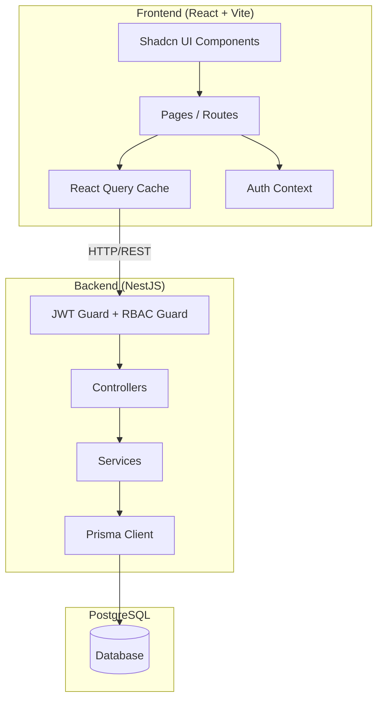
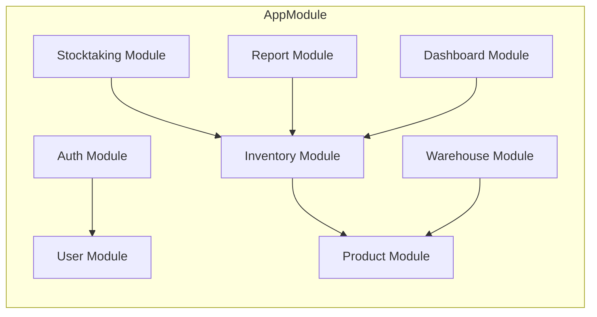
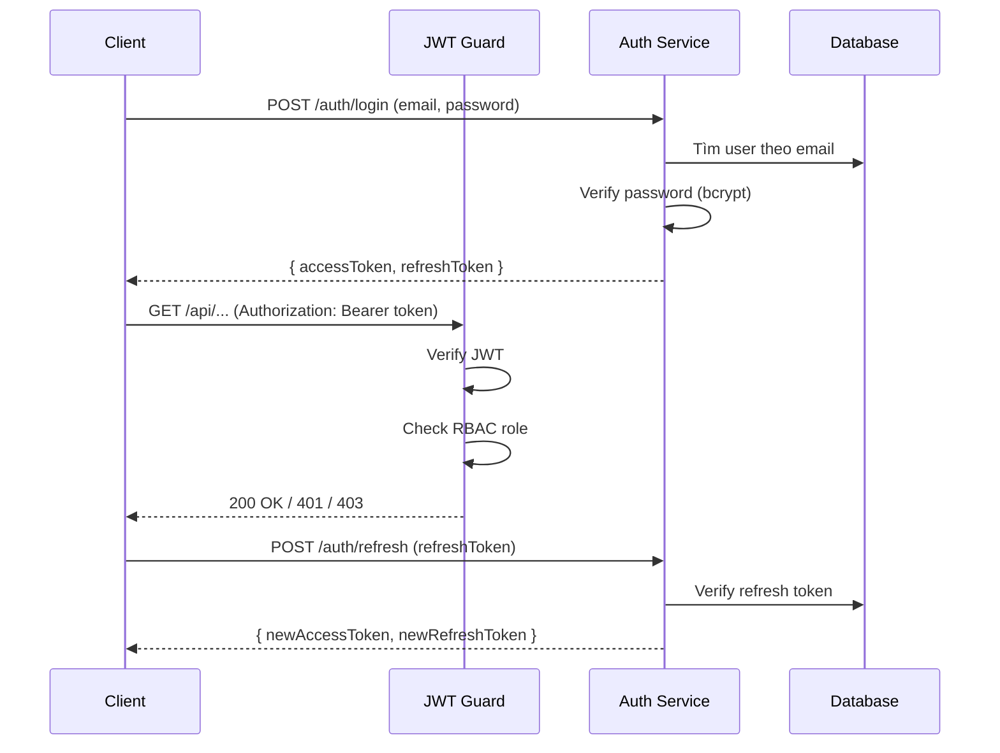
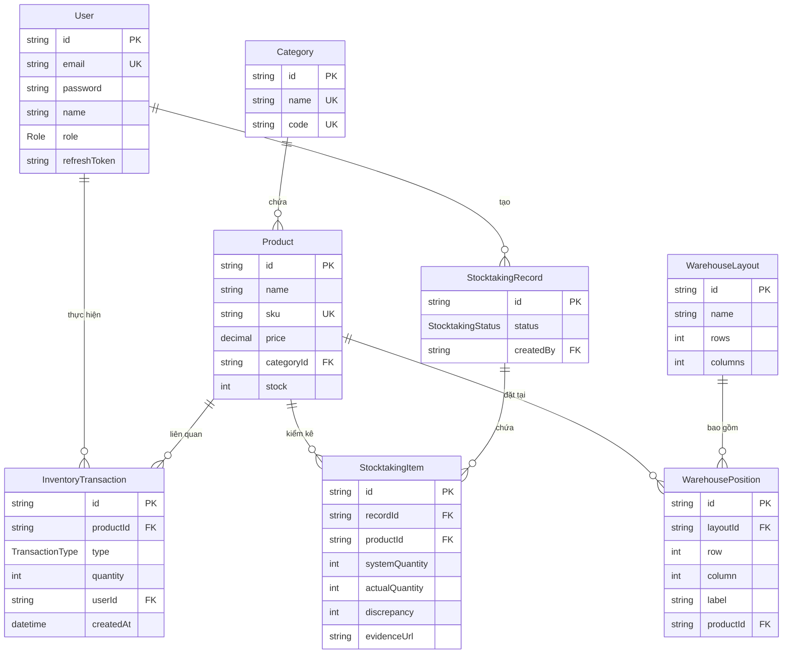

# Tài liệu Thiết kế - Hệ thống Quản lý Kho (Inventory Management System)

## Tổng quan (Overview)

Hệ thống Quản lý Kho là ứng dụng web full-stack theo kiến trúc client-server, thiết kế Mobile-first. Hệ thống cho phép doanh nghiệp quản lý toàn diện quy trình kho hàng: từ xác thực/phân quyền người dùng, quản lý sản phẩm và SKU, nhập/xuất kho, theo dõi tồn kho thời gian thực, báo cáo dashboard, trực quan hóa sơ đồ kho, đến kiểm kê hàng hóa.

**Công nghệ:**
- **Frontend:** React (Vite) + TypeScript + Tailwind CSS + Shadcn UI + React Query
- **Backend:** NestJS + TypeScript + Prisma ORM
- **Database:** PostgreSQL
- **Auth:** JWT (access + refresh token) + RBAC (Admin, Manager, Staff)

**Quyết định thiết kế chính:**
- Sử dụng NestJS module system để tách biệt các domain (auth, product, inventory, warehouse, stocktaking, report)
- Prisma ORM cho type-safe database access và migration management
- React Query cho server state management và optimistic updates
- JWT với refresh token rotation để bảo mật session
- RBAC middleware tại NestJS guard level cho phân quyền tập trung

## Kiến trúc (Architecture)

### Kiến trúc tổng thể



### Kiến trúc Backend (NestJS Modules)



### Luồng xác thực (Authentication Flow)



## Thành phần và Giao diện (Components and Interfaces)

### Backend Components

#### 1. Auth Module

```typescript
// auth.controller.ts
@Controller('auth')
class AuthController {
  @Post('login')
  login(dto: LoginDto): Promise<TokenResponse>

  @Post('refresh')
  refresh(dto: RefreshTokenDto): Promise<TokenResponse>

  @Post('logout')
  @UseGuards(JwtAuthGuard)
  logout(@CurrentUser() user: UserPayload): Promise<void>
}

// auth.service.ts
class AuthService {
  validateUser(email: string, password: string): Promise<User | null>
  generateTokens(user: User): Promise<TokenResponse>
  refreshTokens(refreshToken: string): Promise<TokenResponse>
  invalidateRefreshToken(userId: string): Promise<void>
}

// Interfaces
interface LoginDto {
  email: string;
  password: string;
}

interface TokenResponse {
  accessToken: string;
  refreshToken: string;
}

interface UserPayload {
  userId: string;
  email: string;
  role: Role;
}
```

#### 2. User Module

```typescript
// user.controller.ts
@Controller('users')
@UseGuards(JwtAuthGuard, RolesGuard)
class UserController {
  @Post()
  @Roles(Role.ADMIN)
  create(dto: CreateUserDto): Promise<User>

  @Patch(':id/role')
  @Roles(Role.ADMIN)
  updateRole(id: string, dto: UpdateRoleDto): Promise<User>

  @Delete(':id')
  @Roles(Role.ADMIN)
  delete(id: string, @CurrentUser() currentUser: UserPayload): Promise<void>
}

// user.service.ts
class UserService {
  create(dto: CreateUserDto): Promise<User>
  updateRole(id: string, role: Role): Promise<User>
  delete(id: string, currentUserId: string): Promise<void>
  findByEmail(email: string): Promise<User | null>
  findById(id: string): Promise<User | null>
}
```

#### 3. Product Module

```typescript
// product.controller.ts
@Controller('products')
@UseGuards(JwtAuthGuard)
class ProductController {
  @Post()
  create(dto: CreateProductDto): Promise<Product>

  @Get()
  findAll(query: ProductQueryDto): Promise<PaginatedResponse<Product>>

  @Patch(':id')
  update(id: string, dto: UpdateProductDto): Promise<Product>

  @Delete(':id')
  delete(id: string): Promise<void>
}

// sku-generator.service.ts
class SkuGeneratorService {
  generateSku(categoryName: string, createdAt: Date): Promise<string>
  parseSku(sku: string): SkuComponents
  formatSku(components: SkuComponents): string
  removeDiacritics(text: string): string
}

interface SkuComponents {
  category: string;  // DANHMUC (viết hoa, không dấu)
  id: string;        // 001, 002, ...
  date: string;      // YYYYMMDD
}
```

#### 4. Inventory Module

```typescript
// inventory.controller.ts
@Controller('inventory')
@UseGuards(JwtAuthGuard)
class InventoryController {
  @Post('stock-in')
  stockIn(dto: StockInDto, @CurrentUser() user: UserPayload): Promise<InventoryTransaction>

  @Post('stock-out')
  stockOut(dto: StockOutDto, @CurrentUser() user: UserPayload): Promise<InventoryTransaction>

  @Get()
  getInventory(query: InventoryQueryDto): Promise<PaginatedResponse<InventoryItem>>

  @Get('capacity')
  getCapacity(): Promise<CapacityInfo>
}

// inventory.service.ts
class InventoryService {
  stockIn(productId: string, quantity: number, userId: string): Promise<InventoryTransaction>
  stockOut(productId: string, quantity: number, userId: string): Promise<InventoryTransaction>
  getInventory(filters: InventoryFilters): Promise<PaginatedResponse<InventoryItem>>
  getCapacityRatio(): Promise<number>
  getCurrentStock(productId: string): Promise<number>
}

interface StockInDto {
  productId: string;
  quantity: number;
}

interface StockOutDto {
  productId: string;
  quantity: number;
}

interface InventoryTransaction {
  id: string;
  productId: string;
  type: 'STOCK_IN' | 'STOCK_OUT';
  quantity: number;
  userId: string;
  createdAt: Date;
}

interface CapacityInfo {
  currentTotal: number;
  maxCapacity: number;
  ratio: number;
  isWarning: boolean; // ratio > 0.9
}
```

#### 5. Warehouse Module

```typescript
// warehouse.controller.ts
@Controller('warehouse')
@UseGuards(JwtAuthGuard)
class WarehouseController {
  @Post('layout')
  @Roles(Role.ADMIN)
  createLayout(dto: CreateLayoutDto): Promise<WarehouseLayout>

  @Patch('layout/:id')
  @Roles(Role.ADMIN)
  updateLayout(id: string, dto: UpdateLayoutDto): Promise<WarehouseLayout>

  @Delete('layout/:id')
  @Roles(Role.ADMIN)
  deleteLayout(id: string): Promise<void>

  @Get('layout')
  getLayout(): Promise<WarehouseLayout>

  @Patch('positions/:positionId/product')
  assignProduct(positionId: string, dto: AssignProductDto): Promise<WarehousePosition>
}

// warehouse.service.ts
class WarehouseService {
  createLayout(dto: CreateLayoutDto): Promise<WarehouseLayout>
  updateLayout(id: string, dto: UpdateLayoutDto): Promise<WarehouseLayout>
  getLayout(): Promise<WarehouseLayout>
  assignProductToPosition(positionId: string, productId: string): Promise<WarehousePosition>
  validatePosition(positionId: string): Promise<boolean>
}
```

#### 6. Stocktaking Module

```typescript
// stocktaking.controller.ts
@Controller('stocktaking')
@UseGuards(JwtAuthGuard)
class StocktakingController {
  @Post()
  create(dto: CreateStocktakingDto, @CurrentUser() user: UserPayload): Promise<StocktakingRecord>

  @Patch(':id/approve')
  @Roles(Role.MANAGER, Role.ADMIN)
  approve(id: string, @CurrentUser() user: UserPayload): Promise<StocktakingRecord>

  @Patch(':id/reject')
  @Roles(Role.MANAGER, Role.ADMIN)
  reject(id: string, dto: RejectDto): Promise<StocktakingRecord>

  @Get()
  findAll(query: StocktakingQueryDto): Promise<PaginatedResponse<StocktakingRecord>>
}

// stocktaking.service.ts
class StocktakingService {
  create(dto: CreateStocktakingDto, userId: string): Promise<StocktakingRecord>
  approve(id: string, approverId: string): Promise<StocktakingRecord>
  reject(id: string, reason: string): Promise<StocktakingRecord>
  calculateDiscrepancies(items: StocktakingItem[]): StocktakingItem[]
  validateEvidence(items: StocktakingItem[]): ValidationResult
}
```

#### 7. Report Module

```typescript
// report.controller.ts
@Controller('reports')
@UseGuards(JwtAuthGuard, RolesGuard)
class ReportController {
  @Get('export')
  @Roles(Role.MANAGER, Role.ADMIN)
  exportExcel(query: ReportQueryDto, @Res() res: Response): Promise<void>
}

// report.service.ts
class ReportService {
  generateExcelReport(filters: ReportFilters): Promise<Buffer>
}
```

#### 8. Dashboard Module

```typescript
// dashboard.controller.ts
@Controller('dashboard')
@UseGuards(JwtAuthGuard, RolesGuard)
class DashboardController {
  @Get('summary')
  @Roles(Role.MANAGER, Role.ADMIN)
  getSummary(): Promise<DashboardSummary>

  @Get('chart')
  @Roles(Role.MANAGER, Role.ADMIN)
  getChart(query: ChartQueryDto): Promise<ChartData>
}

interface DashboardSummary {
  totalProducts: number;
  totalStock: number;
  monthlyStockIn: number;
  monthlyStockOut: number;
  capacityRatio: number;
}

interface ChartData {
  labels: string[];
  stockIn: number[];
  stockOut: number[];
  period: 'week' | 'month';
}
```

### Frontend Components

#### Cấu trúc thư mục Frontend

```
src/
├── components/
│   ├── ui/              # Shadcn UI components
│   ├── layout/          # Layout components (Sidebar, Header, MobileNav)
│   ├── auth/            # LoginForm
│   ├── product/         # ProductForm, ProductTable, ProductFilters
│   ├── inventory/       # StockInForm, StockOutForm, InventoryTable
│   ├── warehouse/       # WarehouseGrid, PositionCell, DragDropProvider
│   ├── stocktaking/     # StocktakingForm, StocktakingTable, EvidenceUpload
│   ├── dashboard/       # SummaryCards, LineChart, PeriodToggle
│   └── common/          # CapacityWarning, Pagination, FilterBar
├── hooks/
│   ├── useAuth.ts
│   ├── useProducts.ts
│   ├── useInventory.ts
│   ├── useWarehouse.ts
│   ├── useStocktaking.ts
│   ├── useDashboard.ts
│   └── useReports.ts
├── services/
│   └── api.ts           # Axios instance + interceptors
├── contexts/
│   └── AuthContext.tsx
├── pages/
│   ├── LoginPage.tsx
│   ├── ProductsPage.tsx
│   ├── InventoryPage.tsx
│   ├── WarehousePage.tsx
│   ├── StocktakingPage.tsx
│   ├── DashboardPage.tsx
│   └── UsersPage.tsx
├── types/
│   └── index.ts
└── lib/
    └── utils.ts
```

#### React Query Hooks (ví dụ)

```typescript
// hooks/useInventory.ts
function useInventory(filters: InventoryFilters) {
  return useQuery({
    queryKey: ['inventory', filters],
    queryFn: () => api.get('/inventory', { params: filters }),
    staleTime: 30_000,
  });
}

function useStockIn() {
  const queryClient = useQueryClient();
  return useMutation({
    mutationFn: (dto: StockInDto) => api.post('/inventory/stock-in', dto),
    onMutate: async (dto) => {
      // Optimistic update
      await queryClient.cancelQueries({ queryKey: ['inventory'] });
      const previous = queryClient.getQueryData(['inventory']);
      queryClient.setQueryData(['inventory'], (old) => /* update optimistically */);
      return { previous };
    },
    onError: (err, dto, context) => {
      queryClient.setQueryData(['inventory'], context?.previous);
    },
    onSettled: () => {
      queryClient.invalidateQueries({ queryKey: ['inventory'] });
      queryClient.invalidateQueries({ queryKey: ['capacity'] });
    },
  });
}
```

### Guards & Middleware (NestJS)

```typescript
// jwt-auth.guard.ts
@Injectable()
class JwtAuthGuard extends AuthGuard('jwt') {
  canActivate(context: ExecutionContext): boolean | Promise<boolean>
}

// roles.guard.ts
@Injectable()
class RolesGuard implements CanActivate {
  canActivate(context: ExecutionContext): boolean {
    const requiredRoles = this.reflector.getAllAndOverride<Role[]>(ROLES_KEY, [
      context.getHandler(),
      context.getClass(),
    ]);
    if (!requiredRoles) return true;
    const { user } = context.switchToHttp().getRequest();
    return requiredRoles.includes(user.role);
  }
}

// roles.decorator.ts
const Roles = (...roles: Role[]) => SetMetadata(ROLES_KEY, roles);
```

## Mô hình Dữ liệu (Data Models)

### Prisma Schema

```prisma
generator client {
  provider = "prisma-client-js"
}

datasource db {
  provider = "postgresql"
  url      = env("DATABASE_URL")
}

enum Role {
  ADMIN
  MANAGER
  STAFF
}

enum TransactionType {
  STOCK_IN
  STOCK_OUT
}

enum StocktakingStatus {
  PENDING    // Chờ duyệt
  APPROVED   // Đã duyệt
  REJECTED   // Từ chối
}

model User {
  id           String   @id @default(uuid())
  email        String   @unique
  password     String   // bcrypt hashed
  name         String
  role         Role     @default(STAFF)
  refreshToken String?  // hashed refresh token
  createdAt    DateTime @default(now())
  updatedAt    DateTime @updatedAt

  transactions      InventoryTransaction[]
  stocktakingRecords StocktakingRecord[]

  @@map("users")
}

model Category {
  id       String    @id @default(uuid())
  name     String    @unique
  code     String    @unique // Mã viết hoa không dấu (DONGHO, DIENTHOAI, ...)
  products Product[]

  @@map("categories")
}

model Product {
  id         String   @id @default(uuid())
  name       String
  sku        String   @unique
  price      Decimal  @db.Decimal(15, 2)
  categoryId String
  stock      Int      @default(0) // Tồn kho hiện tại
  createdAt  DateTime @default(now())
  updatedAt  DateTime @updatedAt

  category           Category              @relation(fields: [categoryId], references: [id])
  transactions       InventoryTransaction[]
  warehousePositions WarehousePosition[]
  stocktakingItems   StocktakingItem[]

  @@map("products")
}

model InventoryTransaction {
  id        String          @id @default(uuid())
  productId String
  type      TransactionType
  quantity  Int
  userId    String
  createdAt DateTime        @default(now())

  product Product @relation(fields: [productId], references: [id])
  user    User    @relation(fields: [userId], references: [id])

  @@index([productId, createdAt])
  @@index([type, createdAt])
  @@map("inventory_transactions")
}

model WarehouseLayout {
  id        String   @id @default(uuid())
  name      String
  rows      Int      // Số hàng trong grid
  columns   Int      // Số cột trong grid
  createdAt DateTime @default(now())
  updatedAt DateTime @updatedAt

  positions WarehousePosition[]

  @@map("warehouse_layouts")
}

model WarehousePosition {
  id         String  @id @default(uuid())
  layoutId   String
  row        Int
  column     Int
  label      String? // Nhãn vị trí (A1, B2, ...)
  productId  String?

  layout  WarehouseLayout @relation(fields: [layoutId], references: [id], onDelete: Cascade)
  product Product?        @relation(fields: [productId], references: [id])

  @@unique([layoutId, row, column])
  @@map("warehouse_positions")
}

model WarehouseConfig {
  id          String @id @default(uuid())
  maxCapacity Int    // Sức chứa tối đa

  @@map("warehouse_config")
}

model StocktakingRecord {
  id        String            @id @default(uuid())
  status    StocktakingStatus @default(PENDING)
  createdBy String
  createdAt DateTime          @default(now())
  updatedAt DateTime          @updatedAt

  creator User              @relation(fields: [createdBy], references: [id])
  items   StocktakingItem[]

  @@map("stocktaking_records")
}

model StocktakingItem {
  id              String  @id @default(uuid())
  recordId        String
  productId       String
  systemQuantity  Int     // Số lượng trên hệ thống
  actualQuantity  Int     // Số lượng thực tế
  discrepancy     Int     // = actualQuantity - systemQuantity
  evidenceUrl     String? // URL ảnh/file minh chứng

  record  StocktakingRecord @relation(fields: [recordId], references: [id], onDelete: Cascade)
  product Product           @relation(fields: [productId], references: [id])

  @@map("stocktaking_items")
}
```

### Sơ đồ quan hệ (ERD)




## Thuộc tính Đúng đắn (Correctness Properties)

*Thuộc tính đúng đắn (correctness property) là một đặc tính hoặc hành vi phải luôn đúng trong mọi lần thực thi hợp lệ của hệ thống — về bản chất, đó là một phát biểu hình thức về những gì hệ thống phải làm. Các thuộc tính này đóng vai trò cầu nối giữa đặc tả dễ đọc cho con người và đảm bảo tính đúng đắn có thể kiểm chứng bằng máy.*

### Property 1: Kiểm soát truy cập RBAC

*Với bất kỳ* cặp (vai trò, tài nguyên) nào, hệ thống chỉ cho phép truy cập khi vai trò nằm trong danh sách được phép của tài nguyên đó. Cụ thể: Dashboard chỉ cho Manager/Admin; quản lý sơ đồ kho chỉ cho Admin; phê duyệt kiểm kê chỉ cho Manager/Admin; quản lý người dùng chỉ cho Admin.

**Validates: Requirements 2.1, 10.1, 11.5, 13.1, 15.4**

### Property 2: Tên sản phẩm bắt buộc

*Với bất kỳ* chuỗi nào là rỗng hoặc chỉ chứa khoảng trắng, việc tạo hoặc cập nhật sản phẩm với chuỗi đó làm tên sản phẩm phải bị từ chối, và trạng thái hệ thống không thay đổi.

**Validates: Requirements 3.2, 3.3**

### Property 3: Định dạng SKU

*Với bất kỳ* sản phẩm hợp lệ nào được tạo với một danh mục và ngày tạo, mã SKU được sinh ra phải tuân theo định dạng `DANHMUC-NNN-YYYYMMDD`, trong đó DANHMUC là mã viết hoa không dấu của danh mục, NNN là số thứ tự 3 chữ số, và YYYYMMDD là ngày tạo.

**Validates: Requirements 3.4, 4.1**

### Property 4: Tính duy nhất của SKU

*Với bất kỳ* chuỗi thao tác tạo sản phẩm nào, tất cả các mã SKU được sinh ra phải khác nhau đôi một.

**Validates: Requirements 3.5**

### Property 5: ID trong SKU tăng dần theo danh mục

*Với bất kỳ* chuỗi sản phẩm nào được tạo trong cùng một danh mục, phần ID (số thứ tự) trong SKU phải tăng dần nghiêm ngặt.

**Validates: Requirements 4.2**

### Property 6: Round-trip SKU (phân tích và ghép lại)

*Với bất kỳ* mã SKU hợp lệ nào, việc phân tích (parse) SKU thành các thành phần (DANHMUC, ID, NGAY) rồi ghép lại (format) phải tạo ra chuỗi SKU giống hệt ban đầu.

**Validates: Requirements 4.3**

### Property 7: Chuyển đổi dấu tiếng Việt

*Với bất kỳ* chuỗi tiếng Việt có dấu nào, hàm removeDiacritics phải trả về chuỗi viết hoa chỉ chứa ký tự ASCII (A-Z, 0-9), không chứa bất kỳ ký tự có dấu nào.

**Validates: Requirements 4.4**

### Property 8: Nhập kho tăng tồn kho đúng số lượng

*Với bất kỳ* sản phẩm nào có tồn kho hiện tại là `s` và số lượng nhập hợp lệ `n > 0`, sau khi nhập kho thành công, tồn kho mới phải bằng `s + n`.

**Validates: Requirements 5.1**

### Property 9: Xuất kho giảm tồn kho đúng số lượng

*Với bất kỳ* sản phẩm nào có tồn kho hiện tại `s >= n` và số lượng xuất hợp lệ `n > 0`, sau khi xuất kho thành công, tồn kho mới phải bằng `s - n`.

**Validates: Requirements 6.1**

### Property 10: Từ chối số lượng không hợp lệ

*Với bất kỳ* số lượng `n <= 0`, cả thao tác nhập kho và xuất kho đều phải bị từ chối, và tồn kho không thay đổi.

**Validates: Requirements 5.2, 6.2**

### Property 11: Không thể xuất vượt tồn kho

*Với bất kỳ* sản phẩm nào có tồn kho hiện tại `s` và số lượng xuất `n > s`, thao tác xuất kho phải bị từ chối, và tồn kho vẫn giữ nguyên giá trị `s`.

**Validates: Requirements 6.3**

### Property 12: Ghi nhận lịch sử giao dịch

*Với bất kỳ* thao tác nhập kho hoặc xuất kho thành công nào, hệ thống phải tạo một bản ghi giao dịch (InventoryTransaction) chứa đúng thông tin: sản phẩm, loại giao dịch (STOCK_IN/STOCK_OUT), số lượng, người thực hiện, và thời gian.

**Validates: Requirements 5.3, 6.4**

### Property 13: Tính toán tỷ lệ sức chứa kho

*Với bất kỳ* tổng số lượng hàng `t` và sức chứa tối đa `c > 0`, tỷ lệ sức chứa phải bằng `t / c`, và cảnh báo phải hiển thị khi và chỉ khi tỷ lệ này vượt quá 0.9.

**Validates: Requirements 7.1, 7.3**

### Property 14: Bộ lọc yêu cầu ít nhất một điều kiện

*Với bất kỳ* cấu hình bộ lọc nào mà tất cả các trường đều trống, hệ thống phải từ chối yêu cầu lọc.

**Validates: Requirements 8.3**

### Property 15: Bộ lọc trả về kết quả chính xác

*Với bất kỳ* bộ lọc hợp lệ và tập dữ liệu tồn kho, tất cả các mục được trả về phải thỏa mãn mọi điều kiện lọc đã áp dụng (danh mục, khoảng thời gian, vị trí kho).

**Validates: Requirements 8.5**

### Property 16: Tính toán chênh lệch kiểm kê

*Với bất kỳ* mục kiểm kê nào có số lượng hệ thống `s` và số lượng thực tế `a`, chênh lệch (discrepancy) phải bằng `a - s`.

**Validates: Requirements 12.2**

### Property 17: Yêu cầu minh chứng khi có chênh lệch

*Với bất kỳ* biên bản kiểm kê nào chứa ít nhất một mục có chênh lệch (discrepancy ≠ 0), nếu mục đó không có ảnh/file minh chứng đính kèm, hệ thống phải từ chối lưu biên bản.

**Validates: Requirements 12.3, 12.4**

### Property 18: Phê duyệt kiểm kê điều chỉnh tồn kho

*Với bất kỳ* biên bản kiểm kê nào ở trạng thái "Chờ duyệt", khi được phê duyệt, trạng thái phải chuyển thành "Đã duyệt" và tồn kho của mỗi sản phẩm trong biên bản phải được cập nhật bằng số lượng thực tế.

**Validates: Requirements 13.2**

### Property 19: Từ chối kiểm kê giữ nguyên tồn kho

*Với bất kỳ* biên bản kiểm kê nào ở trạng thái "Chờ duyệt", khi bị từ chối, trạng thái phải chuyển thành "Từ chối" và tồn kho của tất cả sản phẩm phải giữ nguyên không thay đổi.

**Validates: Requirements 13.3**

## Xử lý Lỗi (Error Handling)

### Backend Error Handling

| Tình huống | HTTP Status | Thông báo lỗi |
|---|---|---|
| Đăng nhập sai thông tin | 401 | "Thông tin đăng nhập không chính xác" |
| JWT hết hạn/không hợp lệ | 401 | "Unauthorized" |
| Không có quyền truy cập | 403 | "Forbidden" |
| Staff truy cập dashboard | 403 | "Bạn không có quyền truy cập trang này" |
| Non-Admin thay đổi sơ đồ kho | 403 | "Chỉ Admin mới được thay đổi sơ đồ kho" |
| Staff phê duyệt kiểm kê | 403 | "Chỉ Manager trở lên mới được phê duyệt biên bản kiểm kê" |
| Admin tự xóa tài khoản | 400 | "Admin không thể tự xóa tài khoản của chính mình" |
| Tên sản phẩm trống | 400 | "Tên sản phẩm là bắt buộc" |
| Số lượng nhập <= 0 | 400 | "Số lượng nhập kho phải lớn hơn 0" |
| Số lượng xuất <= 0 | 400 | "Số lượng xuất kho phải lớn hơn 0" |
| Xuất vượt tồn kho | 400 | "Không thể xuất quá số lượng tồn kho hiện tại" |
| Vị trí kho không hợp lệ | 400 | "Vị trí không hợp lệ trong sơ đồ kho" |
| Kiểm kê thiếu minh chứng | 400 | "Yêu cầu đính kèm ảnh/file minh chứng cho các sản phẩm có sai lệch" |
| Lọc không có điều kiện | 400 | "Vui lòng chọn ít nhất một điều kiện lọc" |
| Không có dữ liệu xuất báo cáo | 404 | "Không có dữ liệu để xuất báo cáo" |

### Chiến lược xử lý lỗi

**Backend (NestJS):**
- Sử dụng `ExceptionFilter` toàn cục để bắt và format tất cả lỗi
- Sử dụng `ValidationPipe` với `class-validator` cho input validation
- Sử dụng custom exceptions kế thừa từ `HttpException` cho business logic errors
- Log lỗi với context đầy đủ (userId, endpoint, payload) nhưng không log sensitive data

```typescript
// Cấu trúc response lỗi chuẩn
interface ErrorResponse {
  statusCode: number;
  message: string;
  error: string;
  timestamp: string;
}
```

**Frontend (React):**
- Sử dụng React Query `onError` callback cho API errors
- Hiển thị toast notification cho lỗi nghiệp vụ (400, 403)
- Redirect về trang login cho lỗi xác thực (401)
- Hiển thị trang lỗi chung cho lỗi server (500)
- Optimistic update rollback khi API trả về lỗi

## Chiến lược Kiểm thử (Testing Strategy)

### Tổng quan

Hệ thống sử dụng chiến lược kiểm thử kép (dual testing approach):
- **Unit tests**: Kiểm tra các ví dụ cụ thể, edge cases, và điều kiện lỗi
- **Property-based tests**: Kiểm tra các thuộc tính phổ quát trên nhiều đầu vào ngẫu nhiên

### Công cụ kiểm thử

| Layer | Framework | PBT Library |
|---|---|---|
| Backend (NestJS) | Jest | fast-check |
| Frontend (React) | Vitest + React Testing Library | fast-check |

### Property-Based Tests

Mỗi property test phải:
- Chạy tối thiểu **100 iterations**
- Tham chiếu đến property trong design document
- Sử dụng tag format: **Feature: inventory-management-system, Property {number}: {property_text}**

**Danh sách Property Tests:**

| Property | Mô tả | Module | Loại test |
|---|---|---|---|
| P1 | RBAC access control | Auth/Guards | Property test với generated (role, endpoint) pairs |
| P2 | Tên sản phẩm bắt buộc | Product | Property test với generated whitespace strings |
| P3 | Định dạng SKU | Product/SKU | Property test với generated category names + dates |
| P4 | Tính duy nhất SKU | Product/SKU | Property test với generated product sequences |
| P5 | SKU ID tăng dần | Product/SKU | Property test với generated same-category products |
| P6 | SKU round-trip | Product/SKU | Property test với generated valid SKUs |
| P7 | Chuyển đổi dấu tiếng Việt | Product/SKU | Property test với generated Vietnamese strings |
| P8 | Nhập kho tăng tồn kho | Inventory | Property test với generated (stock, quantity) pairs |
| P9 | Xuất kho giảm tồn kho | Inventory | Property test với generated valid (stock, quantity) pairs |
| P10 | Từ chối số lượng không hợp lệ | Inventory | Property test với generated non-positive numbers |
| P11 | Không xuất vượt tồn kho | Inventory | Property test với generated (stock, quantity) where quantity > stock |
| P12 | Ghi nhận giao dịch | Inventory | Property test với generated stock operations |
| P13 | Tỷ lệ sức chứa kho | Inventory | Property test với generated (total, capacity) pairs |
| P14 | Bộ lọc yêu cầu điều kiện | Inventory | Property test với generated empty filter configs |
| P15 | Bộ lọc trả về kết quả chính xác | Inventory | Property test với generated (filters, data) pairs |
| P16 | Tính toán chênh lệch kiểm kê | Stocktaking | Property test với generated (system, actual) quantity pairs |
| P17 | Yêu cầu minh chứng | Stocktaking | Property test với generated stocktaking items with discrepancies |
| P18 | Phê duyệt điều chỉnh tồn kho | Stocktaking | Property test với generated stocktaking records |
| P19 | Từ chối giữ nguyên tồn kho | Stocktaking | Property test với generated stocktaking records |

### Unit Tests (Example-based)

| Module | Test Cases |
|---|---|
| Auth | Login thành công, login thất bại, refresh token, logout, JWT expired |
| User | Tạo user, cập nhật role, admin tự xóa (bị chặn) |
| Product | CRUD sản phẩm, phân trang, SKU collision handling |
| Inventory | Nhập/xuất kho thành công, cache invalidation |
| Warehouse | Tạo layout, drag-drop, vị trí không hợp lệ |
| Stocktaking | Tạo biên bản, phê duyệt, từ chối |
| Report | Xuất Excel, không có dữ liệu |
| Dashboard | Summary data, chart data, period toggle |

### Integration Tests

| Test | Mô tả |
|---|---|
| Auth flow | Login → access protected endpoint → refresh → logout |
| Stock flow | Tạo sản phẩm → nhập kho → xuất kho → kiểm tra tồn kho |
| Stocktaking flow | Tạo biên bản → phê duyệt → kiểm tra tồn kho cập nhật |
| RBAC flow | Truy cập endpoint với các vai trò khác nhau |
| Report flow | Tạo dữ liệu → xuất Excel → kiểm tra nội dung file |
