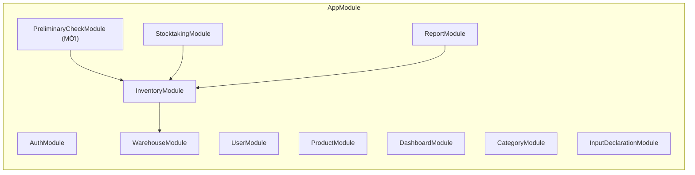
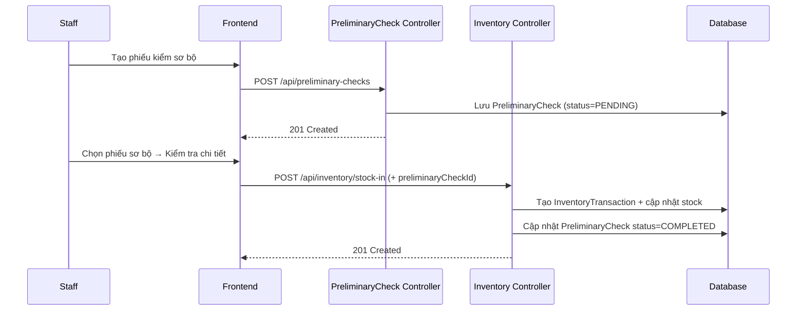
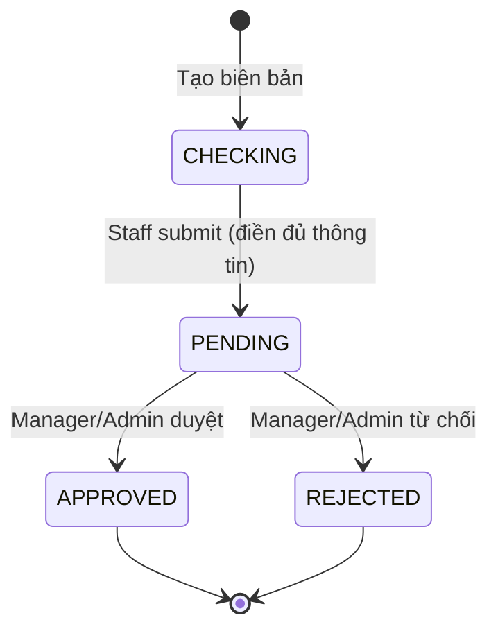
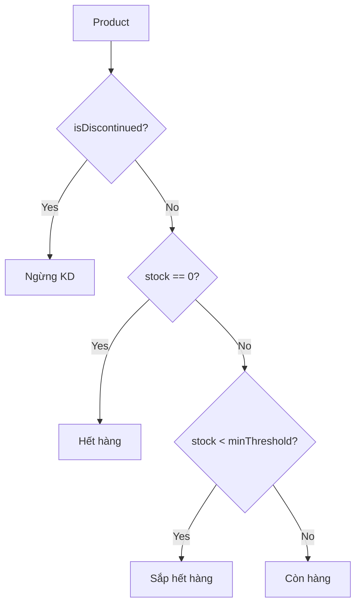
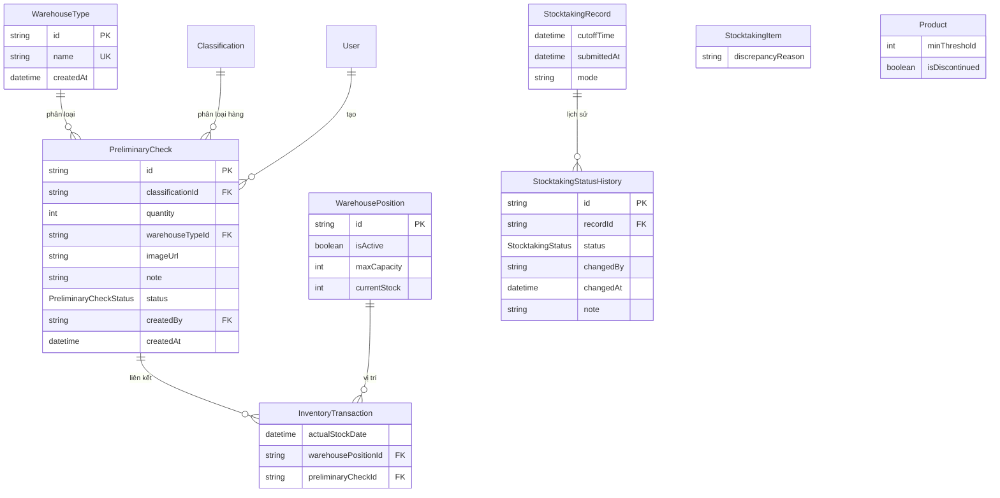

# Tài liệu Thiết kế - Nâng cấp Hệ thống Quản lý Kho V2 (System Upgrade V2)

## Tổng quan (Overview)

Đợt nâng cấp V2 mở rộng và cải tiến 5 module chính của Hệ thống Quản lý Kho hiện tại. Thiết kế tuân thủ kiến trúc hiện có (NestJS modules, Prisma ORM, React + React Query) và mở rộng bằng cách thêm model/field mới vào Prisma schema, thêm endpoint vào controller hiện có hoặc tạo module mới (PreliminaryCheck), và thêm component/page mới ở frontend.

**Công nghệ:** Giữ nguyên stack hiện tại:
- **Backend:** NestJS + TypeScript + Prisma ORM + PostgreSQL
- **Frontend:** React (Vite) + TypeScript + Tailwind CSS + Shadcn UI + React Query
- **Drag/Drop:** @dnd-kit/core (đã cài đặt)
- **Excel:** exceljs (đã cài đặt backend), thêm xlsx cho frontend import
- **PBT:** fast-check (đã cài đặt cả backend và frontend)

**Quyết định thiết kế chính:**

1. **Warehouse:** Mở rộng `WarehousePosition` với `isActive`, `maxCapacity`, `currentStock`. Giữ nguyên grid-based layout nhưng cho phép ô trống (`isActive=false`) để tạo hình dạng tùy chỉnh. Drag/drop position swap dùng @dnd-kit đã có.
2. **Stocktaking:** Thêm enum `CHECKING` vào `StocktakingStatus`, thêm `cutoffTime`, `discrepancyReason` vào schema. Tạo model `StocktakingStatusHistory` để lưu lịch sử trạng thái.
3. **Inventory:** Thêm `minThreshold` và `isDiscontinued` vào `Product`. `businessStatus` là computed field tính từ `stock`, `minThreshold`, `isDiscontinued`.
4. **Stock In/Out:** Tạo module mới `PreliminaryCheckModule` với model `PreliminaryCheck`. Thêm `actualStockDate` vào `InventoryTransaction`. Tạo NXT report service.
5. **Input Declaration:** Tạo model `WarehouseType` tương tự các attribute model hiện có. Tận dụng pattern `InputDeclarationService.create()` đã có.

## Kiến trúc (Architecture)

### Kiến trúc Backend mở rộng



### Luồng Nhập kiểm sơ bộ → Nhập chi tiết



### Luồng Kiểm kê mới (4 trạng thái)



### Luồng tính businessStatus



## Thành phần và Giao diện (Components and Interfaces)

### Backend Components — Thay đổi theo Module

#### MODULE 1: Warehouse (Mở rộng)

```typescript
// warehouse.controller.ts — Thêm endpoints
@Controller('warehouse')
class WarehouseController {
  // ... endpoints hiện có giữ nguyên ...

  @Patch('positions/:id/move')
  @Roles(Role.ADMIN)
  movePosition(id: string, dto: MovePositionDto): Promise<WarehousePosition[]>
  // Swap 2 positions hoặc move to empty cell

  @Patch('positions/:id/label')
  @Roles(Role.ADMIN)
  updateLabel(id: string, dto: UpdateLabelDto): Promise<WarehousePosition>

  @Patch('positions/:id/toggle-active')
  @Roles(Role.ADMIN)
  toggleActive(id: string): Promise<WarehousePosition>

  @Patch('positions/:id/capacity')
  @Roles(Role.ADMIN)
  updateCapacity(id: string, dto: UpdateCapacityDto): Promise<WarehousePosition>

  @Get('positions/:id/skus')
  getPositionSkus(id: string): Promise<PositionSkuInfo[]>

  @Get('layout/with-skus')
  getLayoutWithSkus(): Promise<WarehouseLayoutWithSkus>
}

// DTOs mới
interface MovePositionDto {
  targetRow: number;
  targetColumn: number;
}

interface UpdateLabelDto {
  label: string;
}

interface UpdateCapacityDto {
  maxCapacity: number;
}

interface PositionSkuInfo {
  skuComboId: string;
  compositeSku: string;
  quantity: number;
}
```

#### MODULE 2: Stocktaking (Mở rộng)

```typescript
// stocktaking.controller.ts — Thêm/sửa endpoints
@Controller('stocktaking')
class StocktakingController {
  @Post()
  create(dto: CreateStocktakingV2Dto, user: UserPayload): Promise<StocktakingRecord>
  // Hỗ trợ mode: 'full' | 'selected'

  @Patch(':id/submit')
  submit(id: string, dto: SubmitStocktakingDto): Promise<StocktakingRecord>
  // Chuyển CHECKING → PENDING

  @Patch(':id/approve')
  @Roles(Role.MANAGER, Role.ADMIN)
  approve(id: string, user: UserPayload): Promise<StocktakingRecord>

  @Patch(':id/reject')
  @Roles(Role.MANAGER, Role.ADMIN)
  reject(id: string, dto: RejectDto): Promise<StocktakingRecord>

  @Get(':id/history')
  getStatusHistory(id: string): Promise<StocktakingStatusHistory[]>

  @Get()
  findAll(query: StocktakingQueryV2Dto): Promise<PaginatedResponse<StocktakingRecord>>
  // Thêm filter theo khoảng thời gian
}

// DTOs mới
interface CreateStocktakingV2Dto {
  mode: 'full' | 'selected';
  productIds?: string[];  // Bắt buộc khi mode='selected'
}

interface SubmitStocktakingDto {
  items: SubmitStocktakingItemDto[];
}

interface SubmitStocktakingItemDto {
  itemId: string;
  actualQuantity: number;
  discrepancyReason?: string;
  evidenceUrl?: string;
}
```

#### MODULE 3: Inventory (Mở rộng)

```typescript
// inventory.controller.ts — Thêm endpoints
@Controller('inventory')
class InventoryController {
  // ... endpoints hiện có ...

  @Get('v2')
  getInventoryV2(query: InventoryQueryV2Dto): Promise<PaginatedResponse<InventoryItemV2>>
  // Trả về thêm businessStatus, productCondition

  @Get('export-v2')
  @Roles(Role.MANAGER, Role.ADMIN)
  exportExcelV2(query: InventoryQueryV2Dto, res: Response): Promise<void>
}

// inventory.service.ts — Thêm method
class InventoryService {
  computeBusinessStatus(product: {
    stock: number;
    minThreshold: number;
    isDiscontinued: boolean;
  }): 'CON_HANG' | 'HET_HANG' | 'SAP_HET' | 'NGUNG_KD'
}

interface InventoryQueryV2Dto {
  categoryId?: string;
  businessStatus?: string;
  productConditionId?: string;
  positionId?: string;
  startDate?: string;
  endDate?: string;
  search?: string;  // Tìm theo SKU
  page?: number;
  limit?: number;
}

interface InventoryItemV2 {
  id: string;
  name: string;
  sku: string;
  stock: number;
  minThreshold: number;
  isDiscontinued: boolean;
  businessStatus: string;
  category: Category;
  lastCondition?: ProductCondition;
  positions: WarehousePosition[];
}
```

#### MODULE 4: PreliminaryCheck (MỚI) + Stock In/Out mở rộng

```typescript
// preliminary-check.controller.ts (MỚI)
@Controller('preliminary-checks')
class PreliminaryCheckController {
  @Post()
  create(dto: CreatePreliminaryCheckDto, user: UserPayload): Promise<PreliminaryCheck>

  @Get()
  findAll(query: PreliminaryCheckQueryDto): Promise<PaginatedResponse<PreliminaryCheck>>

  @Get(':id')
  findOne(id: string): Promise<PreliminaryCheck>
}

interface CreatePreliminaryCheckDto {
  classificationId: string;  // Phân loại hàng hoá
  quantity: number;           // Số lượng nhận
  warehouseTypeId?: string;   // Loại kho
  imageUrl?: string;          // Hình ảnh
  note?: string;              // Ghi chú
}

// inventory.controller.ts — Mở rộng stock-in
interface StockInV2Dto extends StockInDto {
  preliminaryCheckId?: string;  // Liên kết phiếu sơ bộ
  actualStockDate?: string;     // Thời gian nhập kho thực tế (ISO string)
  warehousePositionId?: string; // Vị trí kho cụ thể
}

// report.controller.ts — Thêm NXT report
@Controller('reports')
class ReportController {
  @Get('nxt')
  @Roles(Role.MANAGER, Role.ADMIN)
  getNxtReport(query: NxtReportQueryDto): Promise<NxtReportData[]>

  @Get('nxt/export')
  @Roles(Role.MANAGER, Role.ADMIN)
  exportNxtExcel(query: NxtReportQueryDto, res: Response): Promise<void>

  @Get('stock-in/template')
  downloadTemplate(res: Response): Promise<void>

  @Post('stock-in/import')
  importExcel(file: Express.Multer.File, user: UserPayload): Promise<ImportResult>
}

interface NxtReportQueryDto {
  startDate: string;
  endDate: string;
}

interface NxtReportData {
  skuComboId: string;
  compositeSku: string;
  classification: string;
  color: string;
  size: string;
  material: string;
  openingStock: number;    // Tồn đầu kỳ
  totalIn: number;         // Nhập trong kỳ
  totalOut: number;        // Xuất trong kỳ
  closingStock: number;    // Tồn cuối kỳ
}

interface ImportResult {
  success: boolean;
  totalRows: number;
  importedRows: number;
  errors?: ImportError[];
}

interface ImportError {
  row: number;
  field: string;
  message: string;
}
```

#### MODULE 5: Input Declaration (Mở rộng)

```typescript
// input-declaration.controller.ts — Thêm endpoints
@Controller('input-declarations')
class InputDeclarationController {
  // ... endpoints hiện có giữ nguyên ...

  // Loại kho (WarehouseType) — MỚI
  @Get('warehouse-types')
  getWarehouseTypes(): Promise<WarehouseType[]>

  @Post('warehouse-types')
  createWarehouseType(dto: CreateAttributeDto): Promise<WarehouseType>
}

// product.controller.ts — Thêm endpoint cập nhật minThreshold
@Controller('products')
class ProductController {
  @Patch(':id/threshold')
  updateThreshold(id: string, dto: UpdateThresholdDto): Promise<Product>

  @Patch(':id/discontinue')
  toggleDiscontinued(id: string): Promise<Product>
}

interface UpdateThresholdDto {
  minThreshold: number;  // >= 0
}
```

### Frontend Components — Thay đổi theo Module

#### MODULE 1: Warehouse Frontend

```
frontend/src/
├── components/warehouse/
│   ├── WarehouseGrid.tsx        # SỬA: Thêm position drag/drop, isActive toggle
│   ├── PositionCell.tsx         # SỬA: Hiển thị SKU list, color coding, capacity info
│   ├── PositionDetailPopup.tsx  # MỚI: Popup chi tiết SKU + số lượng
│   ├── PositionConfigDialog.tsx # MỚI: Dialog cấu hình capacity, label
│   └── LayoutConfigForm.tsx     # GIỮ NGUYÊN
├── hooks/
│   └── useWarehouse.ts          # SỬA: Thêm mutations cho move, label, toggle, capacity
```

#### MODULE 2: Stocktaking Frontend

```
frontend/src/
├── components/stocktaking/
│   ├── StocktakingForm.tsx          # SỬA: Thêm mode selection (full/selected)
│   ├── StocktakingDetail.tsx        # MỚI: Chi tiết biên bản + nhập thực tế + reason
│   ├── StocktakingStatusHistory.tsx # MỚI: Timeline lịch sử trạng thái
│   └── StocktakingPrintView.tsx     # MỚI: View in biên bản (window.print)
├── pages/
│   └── StocktakingPage.tsx          # SỬA: Thêm filter thời gian, expand detail
├── hooks/
│   └── useStocktaking.ts           # SỬA: Thêm submit, history hooks
```

#### MODULE 3: Inventory Frontend

```
frontend/src/
├── pages/
│   └── InventoryPage.tsx        # SỬA: Thêm cột status, loại hàng, filter nâng cao
├── hooks/
│   └── useInventory.ts          # SỬA: Thêm useInventoryV2, useExportV2
```

#### MODULE 4: Stock In/Out Frontend

```
frontend/src/
├── components/inventory/
│   ├── StockInForm.tsx              # SỬA: Thêm actualStockDate, warehousePosition
│   ├── StockOutForm.tsx             # GIỮ NGUYÊN (minor updates)
│   ├── PreliminaryCheckForm.tsx     # MỚI: Form tạo phiếu kiểm sơ bộ
│   ├── PreliminaryCheckList.tsx     # MỚI: Danh sách phiếu sơ bộ
│   ├── DetailedCheckForm.tsx        # MỚI: Form kiểm tra chi tiết từ phiếu sơ bộ
│   ├── NxtReportTab.tsx             # MỚI: Tab báo cáo NXT
│   ├── ExcelImportDialog.tsx        # MỚI: Dialog import Excel
│   └── ExcelTemplateButton.tsx      # MỚI: Nút tải template
├── pages/
│   └── InventoryPage.tsx            # SỬA: Thêm tabs (Tồn kho, Nhập kiểm sơ bộ, NXT)
├── hooks/
│   ├── useInventory.ts              # SỬA
│   └── usePreliminaryCheck.ts       # MỚI
```

#### MODULE 5: Input Declaration Frontend

```
frontend/src/
├── pages/
│   └── InputDeclarationPage.tsx     # SỬA: Thêm section Loại kho + Ngưỡng Min
├── components/input-declaration/
│   ├── WarehouseTypeSection.tsx      # MỚI
│   └── MinThresholdSection.tsx       # MỚI: Bảng sản phẩm + input ngưỡng
├── hooks/
│   └── useInputDeclarations.ts      # SỬA: Thêm hooks cho warehouse-types, threshold
```

## Mô hình Dữ liệu (Data Models)

### Thay đổi Prisma Schema

#### Thêm enum mới

```prisma
enum StocktakingStatus {
  CHECKING   // MỚI: Đang kiểm kê
  PENDING    // Chờ duyệt
  APPROVED   // Đã duyệt
  REJECTED   // Từ chối
}

enum PreliminaryCheckStatus {
  PENDING     // Chờ kiểm tra chi tiết
  COMPLETED   // Đã kiểm tra chi tiết
}
```

#### Mở rộng model Product

```prisma
model Product {
  // ... fields hiện có giữ nguyên ...
  minThreshold   Int      @default(0)    // MỚI: Ngưỡng tồn kho tối thiểu
  isDiscontinued Boolean  @default(false) // MỚI: Ngừng kinh doanh

  // ... relations hiện có giữ nguyên ...
}
```

#### Mở rộng model WarehousePosition

```prisma
model WarehousePosition {
  // ... fields hiện có giữ nguyên ...
  isActive     Boolean @default(true)  // MỚI: Ô hoạt động hay ô trống
  maxCapacity  Int?                     // MỚI: Sức chứa tối đa (null = không giới hạn)
  currentStock Int     @default(0)      // MỚI: Tồn kho hiện tại tại vị trí

  // ... relations hiện có giữ nguyên ...
  inventoryTransactions InventoryTransaction[] // MỚI: relation
}
```

#### Mở rộng model InventoryTransaction

```prisma
model InventoryTransaction {
  // ... fields hiện có giữ nguyên ...
  actualStockDate      DateTime?  // MỚI: Thời gian nhập kho thực tế
  warehousePositionId  String?    // MỚI: Vị trí kho cụ thể
  preliminaryCheckId   String?    // MỚI: Liên kết phiếu kiểm sơ bộ

  // ... relations hiện có giữ nguyên ...
  warehousePosition WarehousePosition? @relation(fields: [warehousePositionId], references: [id])
  preliminaryCheck  PreliminaryCheck?  @relation(fields: [preliminaryCheckId], references: [id])
}
```

#### Mở rộng model StocktakingRecord

```prisma
model StocktakingRecord {
  // ... fields hiện có giữ nguyên ...
  cutoffTime   DateTime  @default(now()) // MỚI: Thời gian cut-off
  submittedAt  DateTime?                  // MỚI: Thời gian submit
  mode         String    @default("full") // MỚI: 'full' | 'selected'

  // ... relations hiện có giữ nguyên ...
  statusHistory StocktakingStatusHistory[] // MỚI
}
```

#### Mở rộng model StocktakingItem

```prisma
model StocktakingItem {
  // ... fields hiện có giữ nguyên ...
  discrepancyReason String?  // MỚI: Nguyên nhân chênh lệch
}
```

#### Model mới: StocktakingStatusHistory

```prisma
model StocktakingStatusHistory {
  id        String            @id @default(uuid())
  recordId  String
  status    StocktakingStatus
  changedBy String?
  changedAt DateTime          @default(now())
  note      String?

  record StocktakingRecord @relation(fields: [recordId], references: [id], onDelete: Cascade)

  @@map("stocktaking_status_history")
}
```

#### Model mới: PreliminaryCheck

```prisma
model PreliminaryCheck {
  id               String                  @id @default(uuid())
  classificationId String
  quantity         Int
  warehouseTypeId  String?
  imageUrl         String?
  note             String?
  status           PreliminaryCheckStatus  @default(PENDING)
  createdBy        String
  createdAt        DateTime                @default(now())
  updatedAt        DateTime                @updatedAt

  classification Classification @relation(fields: [classificationId], references: [id])
  warehouseType  WarehouseType? @relation(fields: [warehouseTypeId], references: [id])
  creator        User           @relation(fields: [createdBy], references: [id])
  inventoryTransactions InventoryTransaction[]

  @@map("preliminary_checks")
}
```

#### Model mới: WarehouseType

```prisma
model WarehouseType {
  id        String   @id @default(uuid())
  name      String   @unique
  createdAt DateTime @default(now())

  preliminaryChecks PreliminaryCheck[]

  @@map("warehouse_types")
}
```

#### Cập nhật relations cho User và Classification

```prisma
model User {
  // ... thêm relation ...
  preliminaryChecks PreliminaryCheck[]
}

model Classification {
  // ... thêm relation ...
  preliminaryChecks PreliminaryCheck[]
}
```

### Sơ đồ quan hệ mở rộng (ERD)




## Thuộc tính Đúng đắn (Correctness Properties)

*Thuộc tính đúng đắn (correctness property) là một đặc tính hoặc hành vi phải luôn đúng trong mọi lần thực thi hợp lệ của hệ thống — về bản chất, đó là một phát biểu hình thức về những gì hệ thống phải làm. Các thuộc tính này đóng vai trò cầu nối giữa đặc tả dễ đọc cho con người và đảm bảo tính đúng đắn có thể kiểm chứng bằng máy.*

### Property 1: Bất biến di chuyển/hoán đổi vị trí kho

*Với bất kỳ* hai vị trí kho (A, B) trong cùng một layout, khi di chuyển A đến tọa độ của B, hệ thống phải hoán đổi tọa độ: A nhận tọa độ cũ của B và B nhận tọa độ cũ của A. Tổng số vị trí trong layout không thay đổi và tất cả dữ liệu khác (label, productId, capacity) của mỗi vị trí được giữ nguyên.

**Validates: Requirements 1.2, 1.3**

### Property 2: Nhãn vị trí kho duy nhất trong layout

*Với bất kỳ* layout kho và *bất kỳ* chuỗi nhãn đã tồn tại trong layout đó, việc đổi tên một vị trí khác thành nhãn trùng phải bị từ chối, và nhãn của vị trí đó không thay đổi.

**Validates: Requirements 1.6**

### Property 3: Chỉ Admin được thao tác sơ đồ kho

*Với bất kỳ* vai trò không phải Admin (Manager, Staff) và *bất kỳ* thao tác nào trên sơ đồ kho (di chuyển vị trí, đổi tên, toggle active, cập nhật capacity), hệ thống phải từ chối thao tác với lỗi 403.

**Validates: Requirements 1.7**

### Property 4: Không thể vô hiệu hóa vị trí đang chứa hàng

*Với bất kỳ* vị trí kho nào có `currentStock > 0` hoặc có sản phẩm được gán (`productId != null`), việc chuyển trạng thái sang `isActive = false` phải bị từ chối.

**Validates: Requirements 2.6**

### Property 5: Color coding vị trí kho

*Với bất kỳ* vị trí kho nào có `(isActive, currentStock, maxCapacity)`, hàm xác định màu phải trả về: xám nếu `isActive=false` hoặc không có hàng; xanh lá nếu có hàng và `currentStock/maxCapacity <= 0.8`; vàng nếu `currentStock/maxCapacity > 0.8` và chưa đầy; đỏ nếu `currentStock >= maxCapacity`.

**Validates: Requirements 3.2**

### Property 6: Giới hạn hiển thị SKU trên ô vị trí

*Với bất kỳ* danh sách SKU có độ dài `n`, hàm hiển thị phải trả về tối đa 3 SKU. Nếu `n > 3`, phải hiển thị thêm chuỗi `"+{n-3}"` biểu thị số SKU còn lại.

**Validates: Requirements 3.4**

### Property 7: Kiểm soát sức chứa vị trí kho

*Với bất kỳ* vị trí kho nào có `maxCapacity = M` và `currentStock = S`, và *bất kỳ* số lượng nhập `Q`:
- Nếu `S + Q > M`, thao tác nhập kho phải bị từ chối và `currentStock` không thay đổi.
- Nếu `S == M`, thao tác nhập kho phải bị từ chối với thông báo "đã đầy".
- Sức chứa `maxCapacity` phải là số nguyên dương > 0.

**Validates: Requirements 4.3, 4.4, 4.5**

### Property 8: Chế độ kiểm kê tạo đúng tập sản phẩm

*Với bất kỳ* tập sản phẩm trong hệ thống:
- Khi tạo biên bản mode `'full'`, biên bản phải chứa **tất cả** sản phẩm.
- Khi tạo biên bản mode `'selected'` với tập con `S`, biên bản phải chứa **đúng** các sản phẩm trong `S`.

**Validates: Requirements 5.1, 5.3**

### Property 9: Biên bản kiểm kê mới có trạng thái CHECKING

*Với bất kỳ* biên bản kiểm kê nào vừa được tạo, trạng thái ban đầu phải là `CHECKING` và `cutoffTime` phải được ghi nhận.

**Validates: Requirements 6.1, 5.4**

### Property 10: Từ chối submit kiểm kê thiếu nguyên nhân chênh lệch

*Với bất kỳ* biên bản kiểm kê nào chứa ít nhất một mục có `discrepancy != 0` mà `discrepancyReason` là rỗng hoặc null, việc submit phải bị từ chối và trạng thái giữ nguyên `CHECKING`.

**Validates: Requirements 6.5**

### Property 11: Submit kiểm kê chuyển trạng thái sang PENDING

*Với bất kỳ* biên bản kiểm kê hợp lệ (tất cả mục có chênh lệch đều có nguyên nhân), khi submit thành công, trạng thái phải chuyển từ `CHECKING` sang `PENDING` và `submittedAt` phải được ghi nhận.

**Validates: Requirements 6.6**

### Property 12: Lịch sử trạng thái kiểm kê được ghi nhận

*Với bất kỳ* thay đổi trạng thái nào trên biên bản kiểm kê (tạo → CHECKING, submit → PENDING, duyệt → APPROVED, từ chối → REJECTED), hệ thống phải tạo một bản ghi `StocktakingStatusHistory` với trạng thái mới, người thực hiện và thời gian.

**Validates: Requirements 7.3**

### Property 13: Tính toán trạng thái kinh doanh (businessStatus)

*Với bất kỳ* sản phẩm nào có `(stock, minThreshold, isDiscontinued)`:
- Nếu `isDiscontinued = true` → `"Ngừng KD"`
- Nếu `stock == 0` → `"Hết hàng"`
- Nếu `0 < stock < minThreshold` → `"Sắp hết hàng"`
- Nếu `stock >= minThreshold` → `"Còn hàng"`

Hàm `computeBusinessStatus` phải trả về đúng giá trị cho mọi tổ hợp đầu vào hợp lệ.

**Validates: Requirements 8.2, 8.3, 8.4, 17.5**

### Property 14: Bộ lọc tồn kho trả về kết quả chính xác

*Với bất kỳ* tổ hợp bộ lọc hợp lệ (danh mục, trạng thái, loại hàng, vị trí, thời gian, từ khóa) và tập dữ liệu tồn kho, tất cả các mục được trả về phải thỏa mãn **mọi** điều kiện lọc đã áp dụng.

**Validates: Requirements 10.2**

### Property 15: Phiếu kiểm sơ bộ mới có trạng thái PENDING

*Với bất kỳ* phiếu kiểm sơ bộ hợp lệ nào được tạo (classificationId hợp lệ, quantity > 0), trạng thái ban đầu phải là `PENDING` và `createdAt` phải được ghi nhận.

**Validates: Requirements 11.3, 11.4**

### Property 16: Cảnh báo khi số lượng kiểm tra chi tiết khác sơ bộ

*Với bất kỳ* cặp (số lượng sơ bộ, số lượng thực tế) mà hai giá trị khác nhau, hệ thống phải phát cảnh báo. Khi hai giá trị bằng nhau, không có cảnh báo.

**Validates: Requirements 12.4**

### Property 17: Thời gian nhập kho thực tế mặc định

*Với bất kỳ* giao dịch nhập kho nào mà `actualStockDate` không được cung cấp, giá trị `actualStockDate` sau khi lưu phải bằng `createdAt`.

**Validates: Requirements 13.4**

### Property 18: Bất biến báo cáo NXT (Nhập-Xuất-Tồn)

*Với bất kỳ* SKU và khoảng thời gian nào, tồn cuối kỳ phải bằng: `tồn đầu kỳ + tổng nhập trong kỳ - tổng xuất trong kỳ`. Tức là `closingStock = openingStock + totalIn - totalOut`.

**Validates: Requirements 14.4**

### Property 19: Import Excel nguyên tử (atomicity)

*Với bất kỳ* file Excel import nào chứa ít nhất một dòng không hợp lệ, toàn bộ import phải bị rollback: không có giao dịch nhập kho nào được tạo và tồn kho không thay đổi.

**Validates: Requirements 15.6**

### Property 20: Xác thực dòng Excel import

*Với bất kỳ* dòng dữ liệu Excel nào thiếu trường bắt buộc (Phân loại, Màu, Size, Chất liệu, Số lượng) hoặc có giá trị không tồn tại trong danh sách khai báo hoặc số lượng <= 0, hệ thống phải trả về lỗi chi tiết cho dòng đó kèm số dòng và mô tả lỗi.

**Validates: Requirements 15.2, 15.3**

### Property 21: Tên Loại kho bắt buộc và không trùng lặp

*Với bất kỳ* chuỗi rỗng hoặc chỉ chứa khoảng trắng, việc tạo Loại kho phải bị từ chối. *Với bất kỳ* tên đã tồn tại và biến thể hoa/thường của tên đó, việc tạo Loại kho trùng phải bị từ chối.

**Validates: Requirements 16.3, 16.4**

### Property 22: Ngưỡng Min không âm

*Với bất kỳ* số nguyên âm nào, việc cập nhật `minThreshold` cho sản phẩm phải bị từ chối. *Với bất kỳ* số nguyên >= 0, việc cập nhật phải thành công.

**Validates: Requirements 17.3, 17.4**

## Xử lý Lỗi (Error Handling)

### Backend Error Handling

| Module | Tình huống | HTTP Status | Thông báo lỗi |
|---|---|---|---|
| Warehouse | Non-Admin thao tác sơ đồ kho | 403 | "Chỉ Admin mới được thay đổi sơ đồ kho" |
| Warehouse | Nhãn vị trí trùng | 409 | "Nhãn vị trí đã tồn tại trong sơ đồ kho" |
| Warehouse | Vô hiệu hóa vị trí có hàng | 400 | "Vị trí này đang chứa hàng hóa, vui lòng di chuyển hàng trước khi vô hiệu hóa" |
| Warehouse | Sức chứa <= 0 | 400 | "Sức chứa tối đa phải lớn hơn 0" |
| Warehouse | Nhập kho vượt sức chứa vị trí | 400 | "Chỉ cho phép nhập tối đa {X}" |
| Warehouse | Vị trí đã đầy | 400 | "Vị trí này đã đầy, không thể nhập thêm hàng" |
| Stocktaking | Submit thiếu nguyên nhân chênh lệch | 400 | "Vui lòng điền nguyên nhân chênh lệch cho tất cả các dòng có sai lệch" |
| Stocktaking | Duyệt/từ chối biên bản không ở PENDING | 400 | "Chỉ có thể duyệt/từ chối biên bản ở trạng thái Chờ duyệt" |
| Stocktaking | Submit biên bản không ở CHECKING | 400 | "Chỉ có thể submit biên bản ở trạng thái Đang kiểm kê" |
| Inventory | Không có dữ liệu xuất Excel | 404 | "Không có dữ liệu để xuất báo cáo" |
| PreliminaryCheck | Thiếu phân loại hoặc số lượng | 400 | "Phân loại hàng hoá và số lượng là bắt buộc" |
| PreliminaryCheck | Số lượng <= 0 | 400 | "Số lượng nhận phải lớn hơn 0" |
| PreliminaryCheck | Không có quyền truy cập | 403 | "Bạn không có quyền truy cập chức năng này" |
| Stock In/Out | Số lượng kiểm tra khác sơ bộ (warning) | 200 | Warning flag trong response |
| Report NXT | Không có dữ liệu trong khoảng thời gian | 404 | "Không có dữ liệu trong khoảng thời gian đã chọn" |
| Excel Import | File có dòng không hợp lệ | 400 | `{ errors: [{ row, field, message }] }` |
| Excel Import | File format không đúng | 400 | "File không đúng định dạng template" |
| Input Declaration | Tên Loại kho rỗng | 400 | "Tên không được để trống" |
| Input Declaration | Loại kho trùng | 409 | "Loại kho này đã tồn tại" |
| Product | Ngưỡng Min < 0 | 400 | "Ngưỡng Min phải là số không âm" |

### Chiến lược xử lý lỗi

**Backend (NestJS):** Giữ nguyên pattern hiện có:
- `ExceptionFilter` toàn cục cho format lỗi chuẩn
- `ValidationPipe` với `class-validator` cho input validation
- `ConflictException` (409) cho trùng lặp
- `BadRequestException` (400) cho validation
- `ForbiddenException` (403) cho phân quyền
- `NotFoundException` (404) cho không tìm thấy

**Frontend (React):** Giữ nguyên pattern hiện có:
- React Query `onError` callback hiển thị toast
- Redirect 401 về login
- Optimistic update rollback khi lỗi
- Hiển thị danh sách lỗi chi tiết cho Excel import

## Chiến lược Kiểm thử (Testing Strategy)

### Tổng quan

Hệ thống sử dụng chiến lược kiểm thử kép (dual testing approach):
- **Unit tests**: Kiểm tra các ví dụ cụ thể, edge cases, UI rendering, và integration points
- **Property-based tests**: Kiểm tra các thuộc tính phổ quát trên nhiều đầu vào ngẫu nhiên

### Công cụ kiểm thử

| Layer | Framework | PBT Library |
|---|---|---|
| Backend (NestJS) | Jest | fast-check |
| Frontend (React) | Vitest + React Testing Library | fast-check |

### Property-Based Tests

Mỗi property test phải:
- Chạy tối thiểu **100 iterations**
- Tham chiếu đến property trong design document
- Sử dụng tag format: **Feature: system-upgrade-v2, Property {number}: {property_text}**

**Danh sách Property Tests:**

| Property | Mô tả | Module | Loại test |
|---|---|---|---|
| P1 | Bất biến di chuyển/hoán đổi vị trí | Warehouse Service | Property test với generated position pairs |
| P2 | Nhãn vị trí duy nhất | Warehouse Service | Property test với generated label strings |
| P3 | Chỉ Admin thao tác sơ đồ kho | Warehouse Controller | Property test với generated (role, action) pairs |
| P4 | Không vô hiệu hóa vị trí có hàng | Warehouse Service | Property test với generated positions with stock |
| P5 | Color coding vị trí kho | Frontend util | Property test với generated (isActive, currentStock, maxCapacity) |
| P6 | Giới hạn hiển thị SKU "+N" | Frontend util | Property test với generated SKU lists |
| P7 | Kiểm soát sức chứa vị trí | Warehouse/Inventory Service | Property test với generated (maxCapacity, currentStock, quantity) |
| P8 | Chế độ kiểm kê tạo đúng tập SP | Stocktaking Service | Property test với generated product sets + mode |
| P9 | Biên bản mới có trạng thái CHECKING | Stocktaking Service | Property test với generated creation params |
| P10 | Từ chối submit thiếu nguyên nhân | Stocktaking Service | Property test với generated items with discrepancies |
| P11 | Submit chuyển trạng thái PENDING | Stocktaking Service | Property test với generated valid submissions |
| P12 | Lịch sử trạng thái ghi nhận | Stocktaking Service | Property test với generated status transitions |
| P13 | Tính toán businessStatus | Inventory Service | Property test với generated (stock, minThreshold, isDiscontinued) |
| P14 | Bộ lọc tồn kho chính xác | Inventory Service | Property test với generated (filters, dataset) |
| P15 | Phiếu sơ bộ trạng thái PENDING | PreliminaryCheck Service | Property test với generated valid data |
| P16 | Cảnh báo số lượng khác sơ bộ | Frontend/Backend | Property test với generated quantity pairs |
| P17 | actualStockDate mặc định | Inventory Service | Property test với generated transactions |
| P18 | Bất biến NXT | Report Service | Property test với generated transaction histories |
| P19 | Import Excel nguyên tử | Report Service | Property test với generated valid/invalid row mixes |
| P20 | Xác thực dòng Excel | Report Service | Property test với generated row data |
| P21 | Tên Loại kho validation | InputDeclaration Service | Property test với generated strings |
| P22 | Ngưỡng Min không âm | Product Service | Property test với generated integers |

### Unit Tests (Example-based)

| Module | Test Cases |
|---|---|
| Warehouse | Drag/drop position, swap positions, rename label, toggle active, set capacity, get SKU list |
| Stocktaking | Tạo biên bản full/selected, submit, approve, reject, print view, status history |
| Inventory | businessStatus display, color coding, filter nâng cao, export Excel V2 |
| PreliminaryCheck | Tạo phiếu, danh sách phiếu, kiểm tra chi tiết, liên kết stock-in |
| Stock In/Out | actualStockDate, warehousePosition selection, NXT report tab |
| Excel Import/Export | Download template, upload valid file, upload invalid file, error display |
| Input Declaration | Tạo Loại kho, duplicate detection, Ngưỡng Min CRUD |
| Frontend Components | PositionCell color coding, PositionDetailPopup, StocktakingDetail, PreliminaryCheckForm |

### Integration Tests

| Test | Mô tả |
|---|---|
| Warehouse flow | Tạo layout → toggle cells → set capacity → drag/drop → verify |
| Stocktaking V2 flow | Tạo biên bản (full) → nhập thực tế + reason → submit → approve → verify stock update |
| Preliminary → Detail flow | Tạo phiếu sơ bộ → kiểm tra chi tiết → verify stock-in transaction |
| NXT Report flow | Tạo transactions → query NXT → verify opening/closing stock |
| Excel Import flow | Download template → fill data → upload → verify transactions |
| businessStatus flow | Set minThreshold → stock-in/out → verify status changes |
