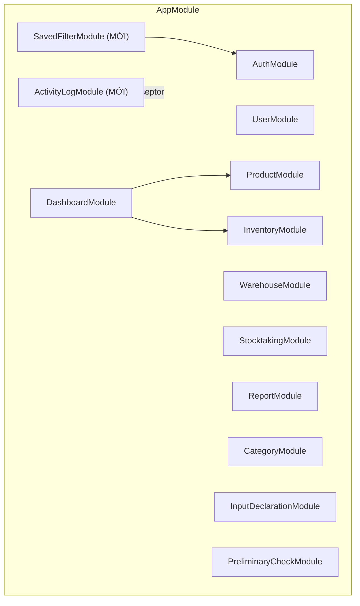
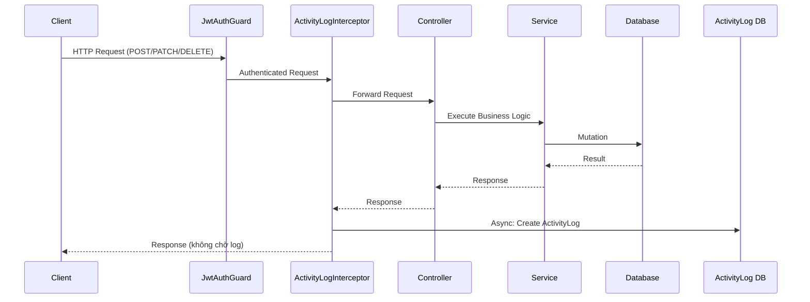
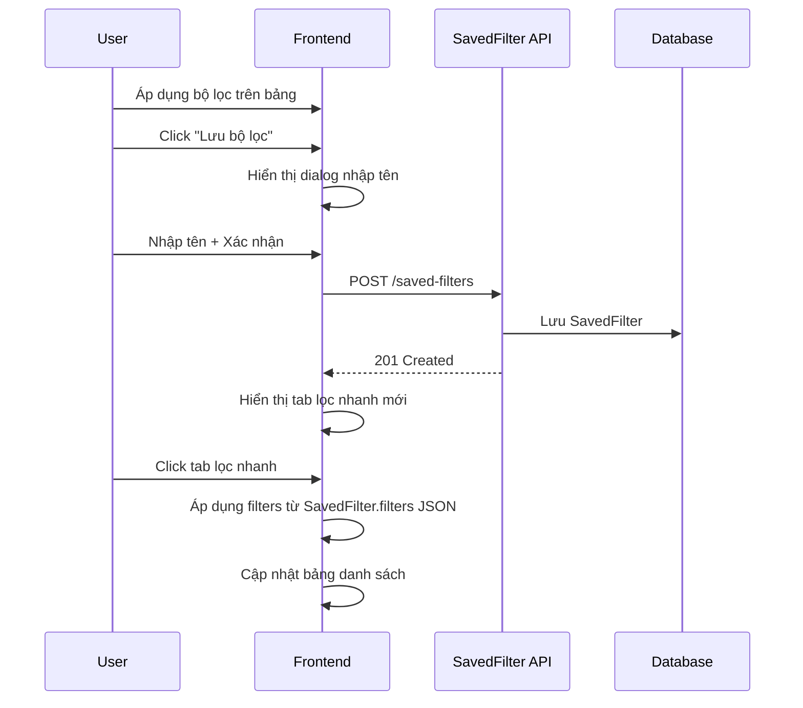
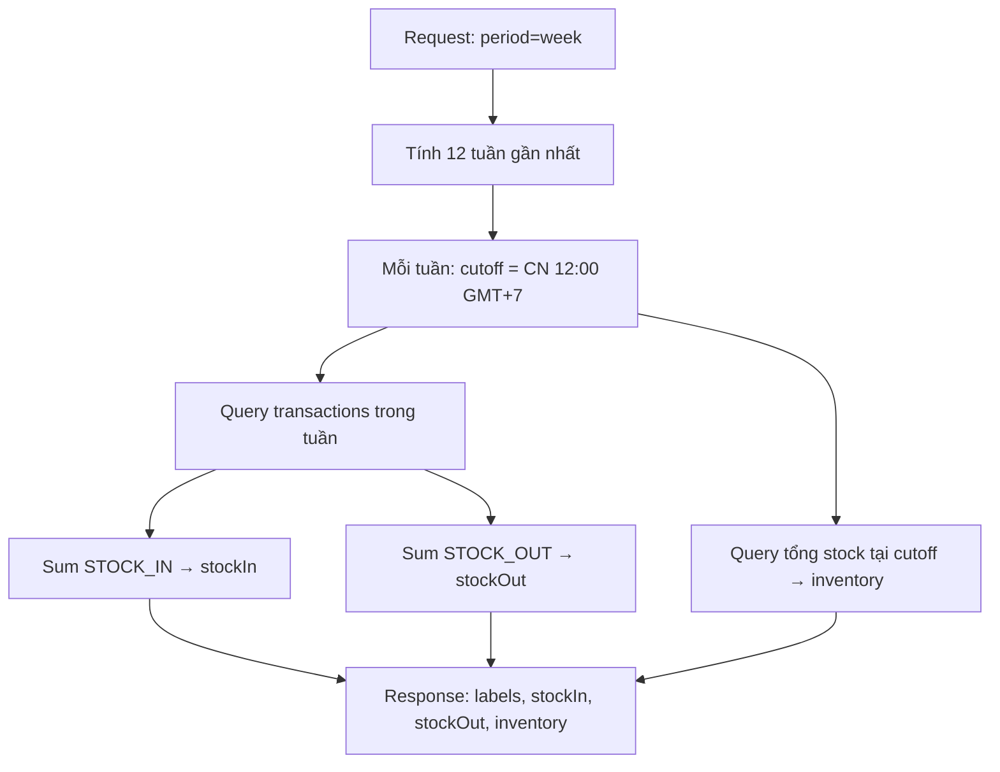
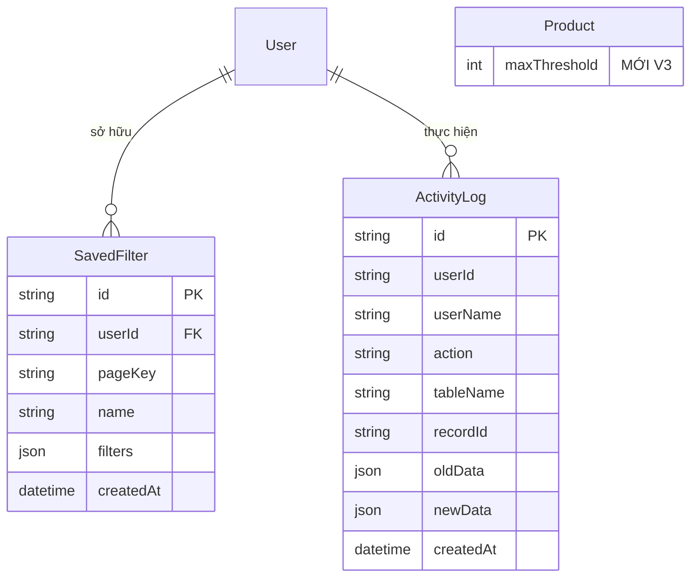

# Tài liệu Thiết kế - Nâng cấp Hệ thống Quản lý Kho V3 (System Upgrade V3)

## Tổng quan (Overview)

Đợt nâng cấp V3 mở rộng 4 module của Hệ thống Quản lý Kho hiện tại: (1) Dashboard nâng cấp với cảnh báo tồn kho, bảng xếp hạng, biểu đồ 3 đường và drill-down chi tiết; (2) Bộ lọc lưu được (Saved Filters) áp dụng chung cho tất cả trang danh sách; (3) Nhật ký hoạt động (Activity Log) ghi nhận mọi thao tác CRUD; (4) Khai báo Input 8 cột dạng bảng tính.

**Công nghệ:** Giữ nguyên stack hiện tại:
- **Backend:** NestJS + TypeScript + Prisma ORM + PostgreSQL
- **Frontend:** React (Vite) + TypeScript + Tailwind CSS + Shadcn UI + React Query + Recharts
- **PBT:** fast-check (đã cài đặt cả backend và frontend)

**Quyết định thiết kế chính:**

1. **Dashboard:** Mở rộng `DashboardService` và `DashboardController` hiện có. Thêm `maxThreshold` vào model `Product`. Tạo các endpoint mới cho alerts, top products, top zones, enhanced chart (3 đường: nhập/xuất/tồn), và detail drill-down. Frontend thêm các component mới vào `DashboardPage`.
2. **Saved Filters:** Tạo model `SavedFilter` mới và module `SavedFilterModule`. Frontend tạo component `ColumnFilter` tái sử dụng và `SavedFilterTabs`. Áp dụng cho tất cả trang danh sách (Products, Inventory, Stocktaking, InputDeclaration).
3. **Activity Log:** Tạo model `ActivityLog` mới và module `ActivityLogModule`. Sử dụng NestJS Interceptor (`ActivityLogInterceptor`) để tự động ghi nhận mọi mutation (POST, PATCH, DELETE). Frontend thêm tab "Nhật ký hoạt động" vào `UsersPage` với diff view.
4. **Input Declaration 8 cột:** Redesign `InputDeclarationPage` thành layout bảng tính 8 cột song song. Tận dụng toàn bộ API và hooks hiện có, chỉ thay đổi layout frontend. Thêm cột Category sử dụng API `/categories` đã có.

## Kiến trúc (Architecture)

### Kiến trúc Backend mở rộng



### Luồng Activity Log Interceptor



### Luồng Saved Filter



### Luồng tính toán biểu đồ 3 đường (tuần)



## Thành phần và Giao diện (Components and Interfaces)

### Backend Components

#### MODULE 1: Dashboard (Mở rộng DashboardService + DashboardController)

```typescript
// dashboard.controller.ts — Thêm endpoints
@Controller('dashboard')
class DashboardController {
  // ... endpoints hiện có giữ nguyên (getSummary, getChart) ...

  @Get('alerts/below-min')
  @Roles(Role.MANAGER, Role.ADMIN)
  getAlertsBelowMin(): Promise<AlertProduct[]>

  @Get('alerts/above-max')
  @Roles(Role.MANAGER, Role.ADMIN)
  getAlertsAboveMax(): Promise<AlertProduct[]>

  @Get('top-products')
  @Roles(Role.MANAGER, Role.ADMIN)
  getTopProducts(@Query() query: TopProductsQueryDto): Promise<TopProduct[]>
  // query.type = 'highest' | 'lowest', query.limit = 20

  @Get('top-zones')
  @Roles(Role.MANAGER, Role.ADMIN)
  getTopZones(@Query() query: TopZonesQueryDto): Promise<TopZone[]>
  // query.type = 'highest' | 'lowest', query.limit = 10

  @Get('chart-v2')
  @Roles(Role.MANAGER, Role.ADMIN)
  getChartV2(@Query() query: ChartQueryDto): Promise<ChartDataV2>
  // Trả về 3 chuỗi: stockIn, stockOut, inventory

  @Get('detail/products')
  @Roles(Role.MANAGER, Role.ADMIN)
  getDetailProducts(@Query() query: DetailQueryDto): Promise<PaginatedResponse<Product>>

  @Get('detail/stock')
  @Roles(Role.MANAGER, Role.ADMIN)
  getDetailStock(@Query() query: DetailQueryDto): Promise<PaginatedResponse<Product>>

  @Get('detail/transactions')
  @Roles(Role.MANAGER, Role.ADMIN)
  getDetailTransactions(@Query() query: DetailTransactionsQueryDto): Promise<PaginatedResponse<TransactionDetail>>
  // query.type = 'stock_in' | 'stock_out'
}

// Interfaces
interface AlertProduct {
  id: string;
  name: string;
  sku: string;
  stock: number;
  minThreshold: number;
  maxThreshold: number;
}

interface TopProduct {
  rank: number;
  id: string;
  name: string;
  sku: string;
  stock: number;
}

interface TopZone {
  rank: number;
  id: string;
  name: string;
  maxCapacity: number;
  currentStock: number;
  usagePercent: number; // (currentStock / maxCapacity) * 100
}

interface ChartDataV2 {
  labels: string[];
  stockIn: number[];
  stockOut: number[];
  inventory: number[]; // MỚI: tồn kho tại mỗi thời điểm
  period: 'week' | 'month';
}

interface TransactionDetail {
  id: string;
  createdAt: string;
  productName: string;
  productSku: string;
  quantity: number;
  userName: string;
}
```

#### MODULE 1: Product (Mở rộng — thêm maxThreshold)

```typescript
// product.controller.ts — Thêm endpoint
@Controller('products')
class ProductController {
  // ... endpoints hiện có giữ nguyên ...

  @Patch(':id/max-threshold')
  updateMaxThreshold(
    @Param('id') id: string,
    @Body() dto: UpdateMaxThresholdDto,
  ): Promise<Product>
}

interface UpdateMaxThresholdDto {
  maxThreshold: number; // >= 0
}
```

#### MODULE 2: SavedFilter (MỚI)

```typescript
// saved-filter.controller.ts (MỚI)
@Controller('saved-filters')
class SavedFilterController {
  @Get()
  findAll(
    @CurrentUser() user: UserPayload,
    @Query('pageKey') pageKey: string,
  ): Promise<SavedFilter[]>

  @Post()
  create(
    @CurrentUser() user: UserPayload,
    @Body() dto: CreateSavedFilterDto,
  ): Promise<SavedFilter>

  @Delete(':id')
  delete(
    @Param('id') id: string,
    @CurrentUser() user: UserPayload,
  ): Promise<void>
}

interface CreateSavedFilterDto {
  pageKey: string;   // 'products' | 'inventory' | 'stocktaking' | 'input-declarations'
  name: string;      // Bắt buộc, không rỗng
  filters: Record<string, unknown>; // JSON chứa điều kiện lọc
}
```

#### MODULE 3: ActivityLog (MỚI)

```typescript
// activity-log.controller.ts (MỚI)
@Controller('activity-logs')
class ActivityLogController {
  @Get()
  @Roles(Role.ADMIN)
  findAll(@Query() query: ActivityLogQueryDto): Promise<PaginatedResponse<ActivityLog>>
}

interface ActivityLogQueryDto {
  userId?: string;
  action?: 'CREATE' | 'UPDATE' | 'DELETE';
  tableName?: string;
  startDate?: string;
  endDate?: string;
  page?: number;
  limit?: number;
}

// activity-log.interceptor.ts (MỚI)
// NestJS Interceptor tự động ghi nhận mutations
@Injectable()
class ActivityLogInterceptor implements NestInterceptor {
  // Intercept POST, PATCH, DELETE requests
  // Ghi nhận: userId, userName, action, tableName, recordId, oldData, newData
  // Ghi không đồng bộ (fire-and-forget) để không ảnh hưởng hiệu năng
}
```

### Frontend Components

#### MODULE 1: Dashboard Frontend

```
frontend/src/
├── components/dashboard/
│   ├── SummaryCards.tsx          # SỬA: Thêm onClick handler cho mỗi card
│   ├── LineChart.tsx             # SỬA: Thêm đường "Tồn" thứ 3 + data labels
│   ├── PeriodToggle.tsx          # GIỮ NGUYÊN
│   ├── AlertSection.tsx          # MỚI: Hiển thị cảnh báo dưới/trên định mức
│   ├── TopProductsTable.tsx      # MỚI: Bảng top 20 sản phẩm
│   ├── TopZonesTable.tsx         # MỚI: Bảng top 10 khu vực
│   └── SummaryDetailDialog.tsx   # MỚI: Dialog chi tiết khi click ô tổng
├── pages/
│   └── DashboardPage.tsx         # SỬA: Thêm sections mới
├── hooks/
│   └── useDashboard.ts           # SỬA: Thêm hooks cho alerts, top, chart-v2, detail
```

#### MODULE 2: Saved Filters Frontend

```
frontend/src/
├── components/common/
│   ├── ColumnFilter.tsx           # MỚI: Component filter dropdown cho cột bảng
│   ├── FilterableTable.tsx        # MỚI: Wrapper table với column filters
│   └── SavedFilterTabs.tsx        # MỚI: Tabs lọc nhanh phía trên bảng
├── hooks/
│   └── useSavedFilters.ts         # MỚI: CRUD hooks cho saved filters
```

#### MODULE 3: Activity Log Frontend

```
frontend/src/
├── components/activity-log/
│   ├── ActivityLogTable.tsx       # MỚI: Bảng nhật ký
│   ├── ActivityLogFilters.tsx     # MỚI: Bộ lọc nhật ký
│   └── ActivityLogDiffView.tsx    # MỚI: Diff view so sánh oldData/newData
├── pages/
│   └── UsersPage.tsx              # SỬA: Thêm tab "Nhật ký hoạt động"
├── hooks/
│   └── useActivityLogs.ts         # MỚI: Query hooks cho activity logs
```

#### MODULE 4: Input Declaration 8 cột Frontend

```
frontend/src/
├── components/input-declaration/
│   ├── SpreadsheetLayout.tsx      # MỚI: Layout 8 cột dạng bảng tính
│   ├── SpreadsheetColumn.tsx      # MỚI: Component cột đơn (danh sách + nút Thêm)
│   ├── AttributeSection.tsx       # GIỮ NGUYÊN (dùng lại cho logic)
│   ├── ProductConditionSection.tsx # GIỮ NGUYÊN
│   ├── StorageZoneSection.tsx     # GIỮ NGUYÊN
│   ├── WarehouseTypeSection.tsx   # GIỮ NGUYÊN
│   └── MinThresholdSection.tsx    # GIỮ NGUYÊN
├── pages/
│   └── InputDeclarationPage.tsx   # SỬA: Thay layout cũ bằng SpreadsheetLayout
├── hooks/
│   └── useInputDeclarations.ts    # SỬA: Thêm useCategories hook
```

## Mô hình Dữ liệu (Data Models)

### Thay đổi Prisma Schema

#### Mở rộng model Product (thêm maxThreshold)

```prisma
model Product {
  // ... fields hiện có giữ nguyên ...
  maxThreshold   Int      @default(0)    // MỚI V3: Ngưỡng tồn kho tối đa
  // ... relations hiện có giữ nguyên ...
}
```

#### Model mới: SavedFilter

```prisma
model SavedFilter {
  id        String   @id @default(uuid())
  userId    String
  pageKey   String   // 'products' | 'inventory' | 'stocktaking' | 'input-declarations'
  name      String
  filters   Json     // Điều kiện lọc dạng JSON
  createdAt DateTime @default(now())

  user User @relation(fields: [userId], references: [id], onDelete: Cascade)

  @@index([userId, pageKey])
  @@map("saved_filters")
}
```

#### Model mới: ActivityLog

```prisma
model ActivityLog {
  id        String   @id @default(uuid())
  userId    String
  userName  String
  action    String   // 'CREATE' | 'UPDATE' | 'DELETE'
  tableName String
  recordId  String
  oldData   Json?    // Dữ liệu cũ (null cho CREATE)
  newData   Json?    // Dữ liệu mới (null cho DELETE)
  createdAt DateTime @default(now())

  @@index([userId])
  @@index([tableName])
  @@index([action])
  @@index([createdAt])
  @@map("activity_logs")
}
```

#### Cập nhật relations cho User

```prisma
model User {
  // ... fields và relations hiện có ...
  savedFilters  SavedFilter[]  // MỚI V3
}
```

### Sơ đồ quan hệ mở rộng (ERD)



## Thuộc tính Đúng đắn (Correctness Properties)

*Thuộc tính đúng đắn (correctness property) là một đặc tính hoặc hành vi phải luôn đúng trong mọi lần thực thi hợp lệ của hệ thống — về bản chất, đó là một phát biểu hình thức về những gì hệ thống phải làm. Các thuộc tính này đóng vai trò cầu nối giữa đặc tả dễ đọc cho con người và đảm bảo tính đúng đắn có thể kiểm chứng bằng máy.*

### Property 1: Lọc cảnh báo tồn kho dưới định mức

*Với bất kỳ* tập sản phẩm nào có các giá trị `(stock, minThreshold)` ngẫu nhiên, hàm lọc cảnh báo dưới định mức phải trả về **đúng và đủ** các sản phẩm thỏa mãn cả hai điều kiện: `stock < minThreshold` VÀ `minThreshold > 0`. Không có sản phẩm nào thỏa điều kiện bị bỏ sót, và không có sản phẩm nào không thỏa điều kiện bị đưa vào.

**Validates: Requirements 1.1, 1.4**

### Property 2: Lọc cảnh báo tồn kho trên định mức

*Với bất kỳ* tập sản phẩm nào có các giá trị `(stock, maxThreshold)` ngẫu nhiên, hàm lọc cảnh báo trên định mức phải trả về **đúng và đủ** các sản phẩm thỏa mãn cả hai điều kiện: `stock > maxThreshold` VÀ `maxThreshold > 0`. Không có sản phẩm nào thỏa điều kiện bị bỏ sót, và không có sản phẩm nào không thỏa điều kiện bị đưa vào.

**Validates: Requirements 2.2, 2.5**

### Property 3: Sắp xếp và giới hạn Top N

*Với bất kỳ* tập sản phẩm (hoặc khu vực) có số lượng `n` và giới hạn `limit`:
- Kết quả "top highest" phải được sắp xếp **giảm dần** theo giá trị (stock hoặc currentStock) và có tối đa `limit` phần tử.
- Kết quả "top lowest" phải được sắp xếp **tăng dần** theo giá trị và có tối đa `limit` phần tử.
- Nếu `n <= limit`, kết quả phải chứa tất cả phần tử.

**Validates: Requirements 3.1, 3.2, 4.1, 4.2**

### Property 4: Tính toán cutoff tuần theo GMT+7

*Với bất kỳ* ngày nào, hàm tính cutoff tuần phải trả về thời điểm 12:00 trưa Chủ nhật theo múi giờ GMT+7 (tức 05:00 UTC Chủ nhật). Ngày trả về phải luôn là Chủ nhật và giờ phải luôn là 05:00 UTC.

**Validates: Requirements 5.2**

### Property 5: Bộ lọc đa cột trả về giao của các điều kiện

*Với bất kỳ* tập dữ liệu và *bất kỳ* tổ hợp bộ lọc trên nhiều cột, tất cả các bản ghi được trả về phải thỏa mãn **mọi** điều kiện lọc đang hoạt động. Không có bản ghi nào vi phạm bất kỳ điều kiện nào được đưa vào kết quả.

**Validates: Requirements 8.3, 8.4**

### Property 6: Tên bộ lọc đã lưu bắt buộc và không rỗng

*Với bất kỳ* chuỗi rỗng hoặc chỉ chứa khoảng trắng, việc tạo `SavedFilter` phải bị từ chối. *Với bất kỳ* chuỗi có ít nhất một ký tự không phải khoảng trắng, việc tạo phải được chấp nhận (nếu chưa đạt giới hạn).

**Validates: Requirements 9.6**

### Property 7: Giới hạn 20 bộ lọc đã lưu mỗi user mỗi trang

*Với bất kỳ* user nào đã có đúng 20 `SavedFilter` cho một `pageKey`, việc tạo thêm `SavedFilter` mới cho cùng `pageKey` phải bị từ chối với thông báo lỗi. *Với bất kỳ* user nào có ít hơn 20, việc tạo phải thành công.

**Validates: Requirements 9.7, 9.8**

### Property 8: Interceptor tạo đúng ActivityLog cho mọi mutation

*Với bất kỳ* thao tác mutation (CREATE, UPDATE, DELETE) trên bất kỳ bảng dữ liệu nào được theo dõi:
- CREATE: ActivityLog phải có `action = 'CREATE'`, `newData` chứa dữ liệu mới, `oldData = null`.
- UPDATE: ActivityLog phải có `action = 'UPDATE'`, `oldData` chứa dữ liệu trước khi sửa, `newData` chứa dữ liệu sau khi sửa.
- DELETE: ActivityLog phải có `action = 'DELETE'`, `oldData` chứa dữ liệu bị xóa, `newData = null`.

**Validates: Requirements 10.1, 10.2, 10.3**

### Property 9: Lọc nhật ký hoạt động trả về kết quả chính xác

*Với bất kỳ* tổ hợp bộ lọc hợp lệ (userId, action, tableName, khoảng thời gian) và tập dữ liệu nhật ký, tất cả các bản ghi được trả về phải thỏa mãn **mọi** điều kiện lọc đã áp dụng.

**Validates: Requirements 11.4**

### Property 10: Chỉ Admin truy cập được API nhật ký hoạt động

*Với bất kỳ* vai trò không phải Admin (Manager, Staff) và *bất kỳ* request nào đến API nhật ký hoạt động, hệ thống phải từ chối với lỗi 403.

**Validates: Requirements 11.7**

## Xử lý Lỗi (Error Handling)

### Backend Error Handling

| Module | Tình huống | HTTP Status | Thông báo lỗi |
|---|---|---|---|
| Dashboard | Non-Manager/Admin truy cập | 403 | "Bạn không có quyền truy cập Dashboard" |
| Product | maxThreshold < 0 | 400 | "Ngưỡng Max phải là số không âm" |
| SavedFilter | Tên rỗng hoặc chỉ khoảng trắng | 400 | "Tên bộ lọc không được để trống" |
| SavedFilter | Đạt giới hạn 20 | 400 | "Đã đạt giới hạn tối đa 20 bộ lọc cho trang này" |
| SavedFilter | Xóa filter không thuộc user | 403 | "Bạn không có quyền xóa bộ lọc này" |
| SavedFilter | Filter không tồn tại | 404 | "Bộ lọc không tồn tại" |
| ActivityLog | Non-Admin truy cập | 403 | "Chỉ Admin mới được xem nhật ký hoạt động" |
| ActivityLog | Không có dữ liệu | 200 | Trả về danh sách rỗng (không lỗi) |

### Chiến lược xử lý lỗi

**Backend (NestJS):** Giữ nguyên pattern hiện có:
- `ValidationPipe` với `class-validator` cho input validation
- `BadRequestException` (400) cho validation errors
- `ForbiddenException` (403) cho phân quyền
- `NotFoundException` (404) cho không tìm thấy
- Activity Log Interceptor: fire-and-forget, lỗi ghi log không ảnh hưởng response chính

**Frontend (React):** Giữ nguyên pattern hiện có:
- React Query `onError` callback hiển thị toast
- Redirect 401 về login
- Hiển thị empty state khi không có dữ liệu

## Chiến lược Kiểm thử (Testing Strategy)

### Tổng quan

Hệ thống sử dụng chiến lược kiểm thử kép (dual testing approach):
- **Unit tests**: Kiểm tra các ví dụ cụ thể, edge cases, UI rendering, và integration points
- **Property-based tests**: Kiểm tra các thuộc tính phổ quát trên nhiều đầu vào ngẫu nhiên

### Công cụ kiểm thử

| Layer | Framework | PBT Library |
|---|---|---|
| Backend (NestJS) | Jest | fast-check |
| Frontend (React) | Vitest + React Testing Library | fast-check |

### Property-Based Tests

Mỗi property test phải:
- Chạy tối thiểu **100 iterations**
- Tham chiếu đến property trong design document
- Sử dụng tag format: **Feature: system-upgrade-v3, Property {number}: {property_text}**

**Danh sách Property Tests:**

| Property | Mô tả | Module | Loại test |
|---|---|---|---|
| P1 | Lọc cảnh báo dưới định mức | Dashboard Service | Property test với generated products |
| P2 | Lọc cảnh báo trên định mức | Dashboard Service | Property test với generated products |
| P3 | Sắp xếp và giới hạn Top N | Dashboard Service | Property test với generated items + sort order |
| P4 | Cutoff tuần GMT+7 | Dashboard Service | Property test với generated dates |
| P5 | Bộ lọc đa cột | Frontend filter logic | Property test với generated data + filters |
| P6 | Tên bộ lọc validation | SavedFilter Service | Property test với generated strings |
| P7 | Giới hạn 20 bộ lọc | SavedFilter Service | Property test với generated filter counts |
| P8 | ActivityLog cho mutations | ActivityLog Interceptor | Property test với generated (action, data) pairs |
| P9 | Lọc nhật ký hoạt động | ActivityLog Service | Property test với generated logs + filters |
| P10 | Admin-only access | ActivityLog Controller | Property test với generated roles |

### Unit Tests

| Module | Test | Mô tả |
|---|---|---|
| Dashboard | Alert empty state | Không có sản phẩm nào dưới/trên định mức |
| Dashboard | Chart V2 structure | Response có 3 arrays: stockIn, stockOut, inventory |
| Dashboard | Detail pagination | Phân trang khi > 20 bản ghi |
| SavedFilter | CRUD operations | Tạo, đọc, xóa bộ lọc |
| ActivityLog | Interceptor skip GET | Interceptor không ghi log cho GET requests |
| ActivityLog | Diff view rendering | Hiển thị diff oldData/newData |
| InputDeclaration | 8-column layout | Render đủ 8 cột |
| InputDeclaration | Add item to column | Thêm giá trị mới vào cột |
